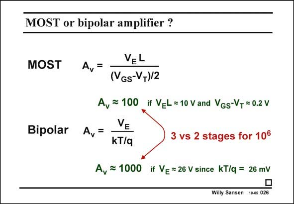

# SANSEN-026 · MOST or bipolar amplifier ?

章节：02 放大器、源极跟随器与共源共栅级  
PDF 页：52；书本页：53；幻灯片编号：026  
状态：unreviewed



## Spectre 仿真

本推导组的代表模型已完成 Spectre 验证；覆盖范围以所列网表为准，未逐一搭建所有幻灯片电路。

[本组波形与仿真报告](../../simulations/ch02/index.html#01-intrinsic-gain)

## 第二章公式推导

由漏极 KCL 与器件电流微分得到增益，再比较固定过驱动电压下的 MOS／BJT。

[完整 Markdown 解释](../../derivations/ch02/01-intrinsic-gain.md) · [排版公式网页](../../derivations/ch02/01-intrinsic-gain.html)

状态：derived_in_stated_model；SFG：not_needed。此组以微分、KCL 或矩阵即可说明机制，没有必要另画 SFG。

模型、近似与来源差异以新推导页为准；下方保留第一步的原始抽取。

## 对应教材讲解

### PDF 52 · 书本 53

Deep submicron CMOS devices provide less and less voltage gain however. Indeed for a relatively large channel length of 2.5 mm (and a V =4 V/mm) the V L E E factor is about 10 V, which yields a gain of 100, using a V −V =0.2 V. GS T For a minimum channel length of 90 nm however, parameter V does not E change all that much, and the voltage gain is now only 3.6!! In practice it is a little bit more, but not much, i.e. about 6. As a result we will have to devise all possible tricks to enhance the gain. Cascodes offer such capability, and gain boosting, as explained later in this chapter. Even with a voltage gain of 100, three stages would be needed to obtain a voltage gain of 106, as is common in operational amplifiers. A bipolar transistor can provide the same gain in only two stages. Indeed in a bipolar transistor, the input voltage is scaled to kT/q rather than to (V −V )/2. GS T We now gain a factor of about 4! The other reason for larger gain is the slightly higher value of the V parameter. E

## 公式／性能结论候选摘录

以下为规则截取的原文，尚未逐项判读。

- PDF 52: Deep submicron CMOS devices provide less and less voltage gain however.
- PDF 52: Indeed for a relatively large channel length of 2.5 mm (and a V =4 V/mm) the V L E E factor is about 10 V, which yields a gain of 100, using a V −V =0.2 V.
- PDF 52: GS T For a minimum channel length of 90 nm however, parameter V does not E change all that much, and the voltage gain is now only 3.6!!
- PDF 52: As a result we will have to devise all possible tricks to enhance the gain.
- PDF 52: Cascodes offer such capability, and gain boosting, as explained later in this chapter.
- PDF 52: Even with a voltage gain of 100, three stages would be needed to obtain a voltage gain of 106, as is common in operational amplifiers.
- PDF 52: A bipolar transistor can provide the same gain in only two stages.
- PDF 52: GS T We now gain a factor of about 4!

## 曲线结论候选摘录

以下为规则截取的原文，尚未逐项判读。

（未由规则找到；不代表原页没有此类内容。）

## 原文条件与近似候选摘录

以下为规则截取的原文，尚未逐项判读。

（未由规则找到；不代表原页没有此类内容。）

## 幻灯片 OCR（未校正）

```text
MOST or bipolar amplifier ?
MOST
Bipolar
Av=
VEL
(VGS-V-)/2
Av
A, = 100 if VeL=10 V and VGs-VT = 0.2 v
VE
kT/q
3 vs 2 stages for 106
A, = 1000 if Ve =26 V since kT/q = 26 mV
Willy Sansen 10-05 026
```

数学上下标、分数及正负号以原图为准。电路图已保留；未核对的连接不输出成可仿真 netlist。
