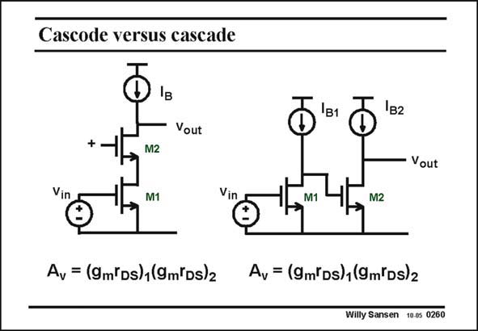

# SANSEN-0260 · Cascode versus cascade

章节：02 放大器、源极跟随器与共源共栅级  
PDF 页：80；书本页：81；幻灯片编号：0260  
状态：unreviewed



## Spectre 仿真

本推导组的代表模型已完成 Spectre 验证；覆盖范围以所列网表为准，未逐一搭建所有幻灯片电路。

[本组波形与仿真报告](../../simulations/ch02/index.html#17-cascade)

## 第二章公式推导

先说明负载限制，再推导两级补偿的极点分离、GBW 与 RHP 零点。

[完整 Markdown 解释](../../derivations/ch02/17-cascade.md) · [排版公式网页](../../derivations/ch02/17-cascade.html)

状态：derived_in_stated_model；SFG：not_needed。此组以微分、KCL 或矩阵即可说明机制，没有必要另画 SFG。

模型、近似与来源差异以新推导页为准；下方保留第一步的原始抽取。

## 对应教材讲解

### PDF 80 · 书本 81

Note also that we are dealing here with a cascode, not a cascade amplifier. Such a cascade amplifier simply consists of two consecutive single-stage amplifiers. The voltage gains are equal but the bandwidths and GBW are very different. Moreover, the power dissipation of a cascade or twostage amplifier is much higher.

## 公式／性能结论候选摘录

以下为规则截取的原文，尚未逐项判读。

- PDF 80: The voltage gains are equal but the bandwidths and GBW are very different.

## 曲线结论候选摘录

以下为规则截取的原文，尚未逐项判读。

（未由规则找到；不代表原页没有此类内容。）

## 原文条件与近似候选摘录

以下为规则截取的原文，尚未逐项判读。

（未由规则找到；不代表原页没有此类内容。）

## 幻灯片 OCR（未校正）

```text
Cascode versus cascade
1в2
Vout
+.
Vin
M2
M1
Vout
Vin
M1
M2
Ay = (9m'Ds)1(9m(Ds)2
Av = (9m*Ds)1(9m*Ds)2
Willy Sansen 10.0s 0260
```

数学上下标、分数及正负号以原图为准。电路图已保留；未核对的连接不输出成可仿真 netlist。
