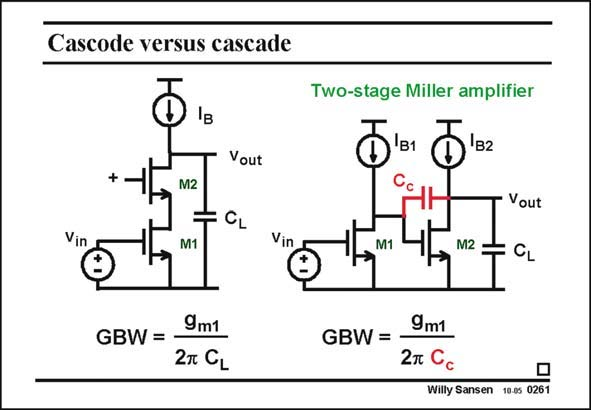

# SANSEN-0261 · Cascode versus cascade

章节：02 放大器、源极跟随器与共源共栅级  
PDF 页：81；书本页：82；幻灯片编号：0261  
状态：unreviewed



## Spectre 仿真

本推导组的代表模型已完成 Spectre 验证；覆盖范围以所列网表为准，未逐一搭建所有幻灯片电路。

[本组波形与仿真报告](../../simulations/ch02/index.html#17-cascade)

## 第二章公式推导

先说明负载限制，再推导两级补偿的极点分离、GBW 与 RHP 零点。

[完整 Markdown 解释](../../derivations/ch02/17-cascade.md) · [排版公式网页](../../derivations/ch02/17-cascade.html)

状态：derived_in_stated_model；SFG：not_needed。此组以微分、KCL 或矩阵即可说明机制，没有必要另画 SFG。

模型、近似与来源差异以新推导页为准；下方保留第一步的原始抽取。

## 对应教材讲解

### PDF 80 · 书本 81

Indeed a cascode is actually a single-stage amplifier with gain enhancement (at low frequencies). This means that one single node is at high impedance. This is the node where the gain is realized and where the signal swing is large. This is also evident from the node where the load capacitance determines the dominant pole. In such a single-stage amplifier the GBW is always determined by that load capacitance and the input transconductance. A cascade amplifier is actually a two stage amplifier. This means that two nodes in that circuit are at high impedance. This also means that there are two nodes where the capacitance to ground gives a pole. Two poles can create stability problems. This problem can be eliminated

### PDF 81 · 书本 82

by adding a Miller capacitance across the second stage, as explained in Chapter 5. It is called a compensation capacitance C . c In such a two-stage amplifier the GBW is always determined by that compensation capacitance and the input transconductance. Obviously, any addition of capacitance usually increases the power consumption. From this point of view, a single-stage amplifier is usually better. One exception may be the output swing. If only one transistor is used for the current source I , then the output swing is only B2 0.4 V less than the supply voltage.

## 公式／性能结论候选摘录

以下为规则截取的原文，尚未逐项判读。

- PDF 80: Indeed a cascode is actually a single-stage amplifier with gain enhancement (at low frequencies).
- PDF 80: This is the node where the gain is realized and where the signal swing is large.
- PDF 81: Obviously, any addition of capacitance usually increases the power consumption.

## 曲线结论候选摘录

以下为规则截取的原文，尚未逐项判读。

（未由规则找到；不代表原页没有此类内容。）

## 原文条件与近似候选摘录

以下为规则截取的原文，尚未逐项判读。

（未由规则找到；不代表原页没有此类内容。）

## 幻灯片 OCR（未校正）

```text
Cascode versus cascade
Two-stage Miller amplifier
+.
Vout
M2
Vout
Vin
M1
Vin
M1
M2
GBW =
9m1
2T CL
9m1
GBW =
Willy Sansen 10.05 0261
```

数学上下标、分数及正负号以原图为准。电路图已保留；未核对的连接不输出成可仿真 netlist。
