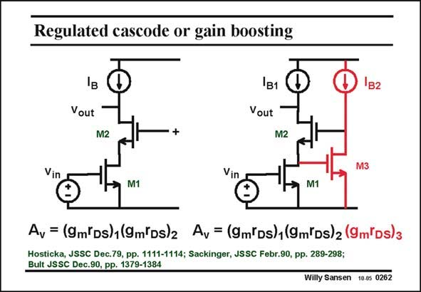

# SANSEN-0262 · Regulated cascode or gain boosting

章节：02 放大器、源极跟随器与共源共栅级  
PDF 页：81；书本页：82；幻灯片编号：0262  
状态：unreviewed



## Spectre 仿真

本推导组的代表模型已完成 Spectre 验证；覆盖范围以所列网表为准，未逐一搭建所有幻灯片电路。

[本组波形与仿真报告](../../simulations/ch02/index.html#18-gain-boosting)

## 第二章公式推导

保留辅助放大器的负号与单极点模型，检查增加的极零对和相消条件。

[完整 Markdown 解释](../../derivations/ch02/18-gain-boosting.md) · [排版公式网页](../../derivations/ch02/18-gain-boosting.html)

状态：derived_in_stated_model；SFG：used。电压／电流混合节点；辅助级展开为已有网表的受控源、电阻、电容模型，不采用 B(s) 黑盒边。

模型、近似与来源差异以新推导页为准；下方保留第一步的原始抽取。

## 对应教材讲解

### PDF 81 · 书本 82

For deep submicron CMOS the gain contributed by two transistors may not be sufficient. For MOSTs with gate lengths of 90 nm and less the gain of one single transistor is less than 10! To obtain more gain, feedback can be applied around the cascode transistor. It is then called a regulated cascode (Hosticka, Sackinger). This is also called gain boosting (Bult). This feedback is actually parallel-series feedback (see Chapter 8), causing the output impedance to rise by the amount of feedback gain. The gain goes up by the same amount. If we realize that feedback amplifier by just one transistor M3, the gain of that transistor is added to the total gain. An additional advantage of that feedback amplifier is that the impedance in the middle (at the gate of M3) is reduced by the same feedback gain.

## 公式／性能结论候选摘录

以下为规则截取的原文，尚未逐项判读。

- PDF 81: For deep submicron CMOS the gain contributed by two transistors may not be sufficient.
- PDF 81: For MOSTs with gate lengths of 90 nm and less the gain of one single transistor is less than 10!
- PDF 81: To obtain more gain, feedback can be applied around the cascode transistor.
- PDF 81: This is also called gain boosting (Bult).
- PDF 81: This feedback is actually parallel-series feedback (see Chapter 8), causing the output impedance to rise by the amount of feedback gain.
- PDF 81: The gain goes up by the same amount.
- PDF 81: If we realize that feedback amplifier by just one transistor M3, the gain of that transistor is added to the total gain.
- PDF 81: An additional advantage of that feedback amplifier is that the impedance in the middle (at the gate of M3) is reduced by the same feedback gain.

## 曲线结论候选摘录

以下为规则截取的原文，尚未逐项判读。

（未由规则找到；不代表原页没有此类内容。）

## 原文条件与近似候选摘录

以下为规则截取的原文，尚未逐项判读。

（未由规则找到；不代表原页没有此类内容。）

## 幻灯片 OCR（未校正）

```text
Regulated cascode or gain boosting
Vout
в1
Vout
1182
M2
M2
Vin
Vin
M3
M1
M1
Av = (9m'Ds)1(9m'Ds)2 Av = (9m'Ds)1(9m'Ds)2 (9m*Ds)3
Hosticka, JSSC Dec.79, pp. 1111-1114; Sackinger, JSSC Febr.90, pp. 289-298;
Bult JSSC Dec.90, pp. 1379-1384
Willy Sansen 10.0s 0262
```

数学上下标、分数及正负号以原图为准。电路图已保留；未核对的连接不输出成可仿真 netlist。
