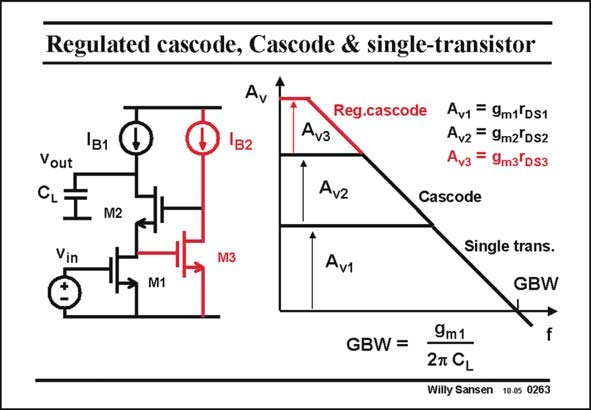

# SANSEN-0263 · Regulated cascode, Cascode & single-transistor

章节：02 放大器、源极跟随器与共源共栅级  
PDF 页：82；书本页：83；幻灯片编号：0263  
状态：unreviewed



## Spectre 仿真

本推导组的代表模型已完成 Spectre 验证；覆盖范围以所列网表为准，未逐一搭建所有幻灯片电路。

[本组波形与仿真报告](../../simulations/ch02/index.html#18-gain-boosting)

## 第二章公式推导

保留辅助放大器的负号与单极点模型，检查增加的极零对和相消条件。

[完整 Markdown 解释](../../derivations/ch02/18-gain-boosting.md) · [排版公式网页](../../derivations/ch02/18-gain-boosting.html)

状态：derived_in_stated_model；SFG：used。电压／电流混合节点；辅助级展开为已有网表的受控源、电阻、电容模型，不采用 B(s) 黑盒边。

模型、近似与来源差异以新推导页为准；下方保留第一步的原始抽取。

## 对应教材讲解

### PDF 82 · 书本 83

Note, however, that gain boosting adds another gain enhancement at low frequencies. It does not alter the GBW. It is therefore good to compare the performance of a regulated cascode, as cascode and a single-stage amplifier. All of them have the same GBW but widely different gains and bandwidths. Clearly, if this amplifier is to be only used at high frequencies, then there is no need for cascodes! Regulated cascodes will always be used whenever we have to combine high GBW with high gain. For high-frequency performance we need to use high V −V and minimum channel GS T length, which inevitably leads to lower gains. By means of gain boosting we have a circuit trick, by which we can increase the gain.

## 公式／性能结论候选摘录

以下为规则截取的原文，尚未逐项判读。

- PDF 82: Note, however, that gain boosting adds another gain enhancement at low frequencies.
- PDF 82: It is therefore good to compare the performance of a regulated cascode, as cascode and a single-stage amplifier.
- PDF 82: Regulated cascodes will always be used whenever we have to combine high GBW with high gain.
- PDF 82: By means of gain boosting we have a circuit trick, by which we can increase the gain.

## 曲线结论候选摘录

以下为规则截取的原文，尚未逐项判读。

（未由规则找到；不代表原页没有此类内容。）

## 原文条件与近似候选摘录

以下为规则截取的原文，尚未逐项判读。

（未由规则找到；不代表原页没有此类内容。）

## 幻灯片 OCR（未校正）

```text
Regulated cascode, Cascode & single-transistor
1B1
Vout
CL:
M2
Vin
M1
Ay
Reg.cascode
Av3
1B2
Avz
M3
Av1
Av1 = 9m1*DS1
Avz = 9m2 DS2
Avз = 9m3 DS3
Cascode
Single trans.
GBW
f
GBW=
9m1
2T CL
Willy Sansen 10.0s 0263
```

数学上下标、分数及正负号以原图为准。电路图已保留；未核对的连接不输出成可仿真 netlist。
