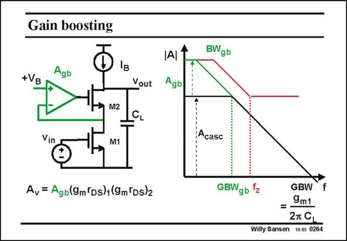

# SANSEN-0264 · Gain boosting

章节：02 放大器、源极跟随器与共源共栅级  
PDF 页：82；书本页：83；幻灯片编号：0264  
状态：unreviewed



## Spectre 仿真

本推导组的代表模型已完成 Spectre 验证；覆盖范围以所列网表为准，未逐一搭建所有幻灯片电路。

[本组波形与仿真报告](../../simulations/ch02/index.html#18-gain-boosting)

## 第二章公式推导

保留辅助放大器的负号与单极点模型，检查增加的极零对和相消条件。

[完整 Markdown 解释](../../derivations/ch02/18-gain-boosting.md) · [排版公式网页](../../derivations/ch02/18-gain-boosting.html)

状态：derived_with_source_notes；SFG：used。电压／电流混合节点；辅助级展开为已有网表的受控源、电阻、电容模型，不采用 B(s) 黑盒边。

模型、近似与来源差异以新推导页为准；下方保留第一步的原始抽取。

## 对应教材讲解

### PDF 82 · 书本 83

It is obvious that the gain boosting amplifier, which was just one transistor before, can be replaced by a full operational amplifier with large gain A . Its nongb inverting input is connected to a biasing voltage V . The B feedback loop will ensure that the voltage at the source of transistor M2 is kept as constant as possible. In this case, full gain is added on top of the gain characteristic of the cascode. Obviously, this is only required if real high gains are required at real low frequencies. This is the case, for example, in low-distortion amplifiers at audio frequencies and below. However, the design of such a gain boosting stage is not trivial. It has its own gain A , gb bandwidth BW , and hence GBW . We have to make sure that the GBW coincides exactly gb gb with the BW of the original cascode amplifier, if not a pole-zero doublet occurs. Such a doublet is lethal for the settling time of that amplifier, as explained next.

## 公式／性能结论候选摘录

以下为规则截取的原文，尚未逐项判读。

- PDF 82: It is obvious that the gain boosting amplifier, which was just one transistor before, can be replaced by a full operational amplifier with large gain A .
- PDF 82: In this case, full gain is added on top of the gain characteristic of the cascode.
- PDF 82: However, the design of such a gain boosting stage is not trivial.
- PDF 82: It has its own gain A , gb bandwidth BW , and hence GBW .

## 曲线结论候选摘录

以下为规则截取的原文，尚未逐项判读。

- PDF 82: In this case, full gain is added on top of the gain characteristic of the cascode.

## 原文条件与近似候选摘录

以下为规则截取的原文，尚未逐项判读。

（未由规则找到；不代表原页没有此类内容。）

## 幻灯片 OCR（未校正）

```text
Gain boosting
Agb
+VB
Vout
Vin
M2
M1
Av = Agb(9m Ds)1(9m°Ds)2
|AI
Agb
BWgb
¡Acasc
GBWgb 'z
GBW
f
=-
9m1
2T GL
Willy Sansen 10.0s 0264
```

数学上下标、分数及正负号以原图为准。电路图已保留；未核对的连接不输出成可仿真 netlist。
