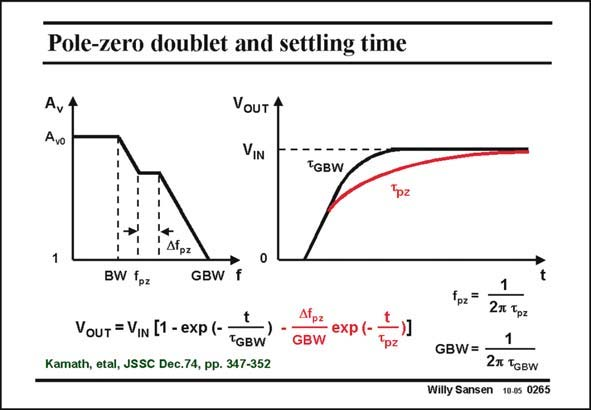

# SANSEN-0265 · Pole-zero doublet and settling time

章节：02 放大器、源极跟随器与共源共栅级  
PDF 页：83；书本页：84；幻灯片编号：0265  
状态：unreviewed



## Spectre 仿真

本推导组的代表模型已完成 Spectre 验证；覆盖范围以所列网表为准，未逐一搭建所有幻灯片电路。

[本组波形与仿真报告](../../simulations/ch02/index.html#19-doublet-settling)

## 第二章公式推导

从闭环传输作部分分式，显示幅值较小的慢模态留数如何限制建立时间。

[完整 Markdown 解释](../../derivations/ch02/19-doublet-settling.md) · [排版公式网页](../../derivations/ch02/19-doublet-settling.html)

状态：derived_with_source_notes；SFG：not_needed。此组以微分、KCL 或矩阵即可说明机制，没有必要另画 SFG。

模型、近似与来源差异以新推导页为准；下方保留第一步的原始抽取。

## 对应教材讲解

### PDF 83 · 书本 84

If a pole-zero doublet occurs in the middle of the Bode diagram, then the settling time is ruined. The settling is the time required to reach the final value of the output voltage, within a certain error. For example, when we take an opamp with unity-gain feedback, then the bandwidth BW coincides with the GBW. When we apply a step waveform to that amplifier, we expect the output to follow with a time constant 1/(2pGBW), as described by an exponential. To reach a settling time of 0.1%, we need to wait ln(1000) or 6.9 times this time constant. When we have a pole-zero doublet at fairly low frequencies f , with a large spreading Df , pz pz then an additional exponential shows up in the time response, with a much larger time constant 1/(2pf ). pz It will take much more time to reach the final output voltage within 0.1%. The 0.1% settling time is much longer. In all switching applications, such as switched-capacitor filters, the settling time determines what is the minimum width of the clock pulses. It determines the maximum frequency of such a system (see Chapter 14). In such systems, pole-zero doublets must be avoided at all cost!

## 公式／性能结论候选摘录

以下为规则截取的原文，尚未逐项判读。

- PDF 83: For example, when we take an opamp with unity-gain feedback, then the bandwidth BW coincides with the GBW.

## 曲线结论候选摘录

以下为规则截取的原文，尚未逐项判读。

- PDF 83: If a pole-zero doublet occurs in the middle of the Bode diagram, then the settling time is ruined.

## 原文条件与近似候选摘录

以下为规则截取的原文，尚未逐项判读。

- PDF 83: When we have a pole-zero doublet at fairly low frequencies f , with a large spreading Df , pz pz then an additional exponential shows up in the time response, with a much larger time constant 1/(2pf ). pz It will take much more time to reach the final output voltage within 0.1%.

## 幻灯片 OCR（未校正）

```text
Pole-zero doublet and settling time
Av
Avo
VoUT 4
VIN
TGBW
, Afpz
BW fpz
GBW
f
VouT =VIN [1 - exp (-
TGBW
Kamath, etal, JSSC Dec.74, pp. 347-352
• еxp (-
GBW
Tpz
t
fpz*
1
27 Tрz
GBW=
27 TGBW
Willy Sansen 10.05 0265
```

数学上下标、分数及正负号以原图为准。电路图已保留；未核对的连接不输出成可仿真 netlist。
