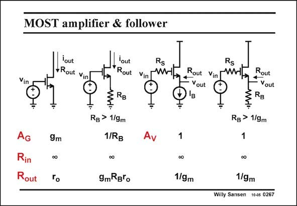

# SANSEN-0267 · MOST amplifier & follower

章节：02 放大器、源极跟随器与共源共栅级  
PDF 页：84；书本页：85；幻灯片编号：0267  
状态：unreviewed



## Spectre 仿真

本推导组的代表模型已完成 Spectre 验证；覆盖范围以所列网表为准，未逐一搭建所有幻灯片电路。

[本组波形与仿真报告](../../simulations/ch02/index.html#20-port-summary)

## 第二章公式推导

用测试源核对有限 β、输入电阻与带局部负反馈的放大级的输出电阻，避免把表格破折号当零。

[完整 Markdown 解释](../../derivations/ch02/20-port-summary.md) · [排版公式网页](../../derivations/ch02/20-port-summary.html)

状态：derived_in_stated_model；SFG：not_needed。此组以微分、KCL 或矩阵即可说明机制，没有必要另画 SFG。

模型、近似与来源差异以新推导页为准；下方保留第一步的原始抽取。

## 对应教材讲解

### PDF 84 · 书本 85

The gains of a single-transistor amplifier and a cascode are given in this slide. The input and output impedances are also added. It is clear that the input impedance is always infinity. The output impedance is resistive as no capacitances are included. It differs widely depending on the actual circuit configuration.

## 公式／性能结论候选摘录

以下为规则截取的原文，尚未逐项判读。

- PDF 84: It differs widely depending on the actual circuit configuration.

## 曲线结论候选摘录

以下为规则截取的原文，尚未逐项判读。

（未由规则找到；不代表原页没有此类内容。）

## 原文条件与近似候选摘录

以下为规则截取的原文，尚未逐项判读。

（未由规则找到；不代表原页没有此类内容。）

## 幻灯片 OCR（未校正）

```text
MOST amplifier & follower
Vin
Yout
Rout Vin
lout
Rs
*Rout
Vin TMHE
Rs
Rout Vin FMHE,
• Vout
Rout
- Vout
AG
Rin
Rout
9m
RB > 1/9m
1/RB
0o
9mRB'o
RB > 1/9m
1
1
0o
1/gm
1/gm
Willy Sansen 10-05 0267
```

数学上下标、分数及正负号以原图为准。电路图已保留；未核对的连接不输出成可仿真 netlist。
