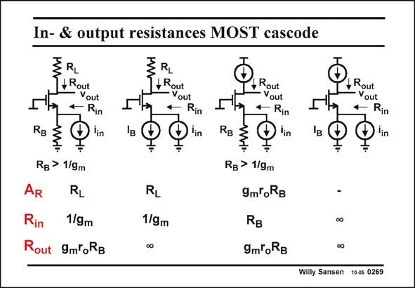

# SANSEN-0269 · In- & output resistances MOST cascode

章节：02 放大器、源极跟随器与共源共栅级  
PDF 页：85；书本页：86；幻灯片编号：0269  
状态：unreviewed



## Spectre 仿真

本推导组的代表模型已完成 Spectre 验证；覆盖范围以所列网表为准，未逐一搭建所有幻灯片电路。

[本组波形与仿真报告](../../simulations/ch02/index.html#12-common-gate)

## 第二章公式推导

先固定测试电流方向与负载端接，再由同一组 KCL 得三种端口量。

[完整 Markdown 解释](../../derivations/ch02/12-common-gate.md) · [排版公式网页](../../derivations/ch02/12-common-gate.html)

状态：derived_in_stated_model；SFG：not_needed。此组以微分、KCL 或矩阵即可说明机制，没有必要另画 SFG。

模型、近似与来源差异以新推导页为准；下方保留第一步的原始抽取。

## 对应教材讲解

### PDF 85 · 书本 86

For a MOST cascode, the gains, the input and output impedances are calculated as well, again without capacitances. As a gain, the output voltage is taken versus input current. The results are very different depending on whether the input current source has an infinite output resistance or an output resistance R . B

## 公式／性能结论候选摘录

以下为规则截取的原文，尚未逐项判读。

- PDF 85: As a gain, the output voltage is taken versus input current.
- PDF 85: The results are very different depending on whether the input current source has an infinite output resistance or an output resistance R .

## 曲线结论候选摘录

以下为规则截取的原文，尚未逐项判读。

（未由规则找到；不代表原页没有此类内容。）

## 原文条件与近似候选摘录

以下为规则截取的原文，尚未逐项判读。

（未由规则找到；不代表原页没有此类内容。）

## 幻灯片 OCR（未校正）

```text
In- & output resistances MOST cascode
+ Rout
Yout
Rin
) lin
Iв
Z RL
+Rout
- Yout
Rin
Dlin
Rg
ww•
RB > 1/9m
AR
Rin
1/9m
Rout
9moRg
RL
1/9m
0o
Rout
Yout
* Rin
Đ in
÷
RB > 1/9m
9m*oRB
RB
9moRB
,Rout
- Yout
1 Rin
Điin
-
∞o
0o
Willy Sansen 10-05 0269
```

数学上下标、分数及正负号以原图为准。电路图已保留；未核对的连接不输出成可仿真 netlist。
