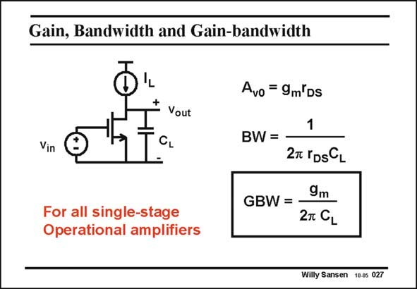
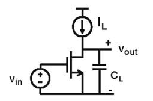

# SANSEN-027 · 增益、带宽与增益带宽积

章节：02 放大器、源极跟随器与共源共栅级  
PDF 页：53；书本页：54；幻灯片编号：027  
状态：representative_case_visually_reviewed



## Spectre 仿真

本推导组的代表模型已完成 Spectre 验证；覆盖范围以所列网表为准，未逐一搭建所有幻灯片电路。

[本组波形与仿真报告](../../simulations/ch02/index.html#02-single-pole)

## 第二章公式推导

推导负载电容主极点、交越频率、GBW 与 029 的尺寸例题。

[完整 Markdown 解释](../../derivations/ch02/02-single-pole.md) · [排版公式网页](../../derivations/ch02/02-single-pole.html)

状态：derived_in_stated_model；SFG：not_needed。此组以微分、KCL 或矩阵即可说明机制，没有必要另画 SFG。

模型、近似与来源差异以新推导页为准；下方保留第一步的原始抽取。

## 对应教材讲解

### PDF 53 · 书本 54

At higher frequencies, the voltage gain will fall off as a result of all capacitances. There are three positions where a capacitance can occur. Normally the load capacitance is the largest one, as it consists of all interconnect capacitance to the next stage and the feedback capacitances applied (as in switched-capacitance filters). Here only a load capacitance C is present. The low L frequency gain A is as v0 before. The pole frequency, at which the gain starts decreasing is called the bandwidth BW or the −3dB frequency. It is simply determined by the output RC time constant. The product of the low-frequency gain and the bandwidth is called the Gain-Bandwidth product GBW. It is by far the most important quality factor of an amplifier. Actually it is the most important specification of an amplifier. Later on we will compare amplifiers by means of a Figure of Merit (FOM), which quotes how much GBW can be obtained for a certain load capacitance and power consumption. The GBW itself is readily obtained. It only depends on the transistor transconductance and the load capacitance, not on the output resistance. We will see that this expression is valid for all possible single-stage amplifiers. It is therefore a very important expression!

## 已核对的抽取

单管共源级只有输出负载电容时，带宽由输出 RC 时常数决定；增益带宽积只包含跨导与负载电容。

- `A_{v0}=g_m r_{DS}` — 幻灯片使用正值表示低频增益大小；有号的共源电压增益另含反相符号。
- `BW=\frac{1}{2\pi r_{DS}C_L}` — 输出端单极点的 −3 dB 带宽，单位 Hz。
- `GBW=\frac{g_m}{2\pi C_L}` — 在本页单极点模型下，A_v0 × BW；与 r_DS 无关。



### 曲线结论

- 波特图在下一张 028，与本页公式配对。

### 条件与近似注记

- 原文明示：本页仅保留负载电容 C_L。
- 图面模型判读：偏置电流源视为理想；若有有限负载电阻或其他显著电容，不能直接沿用本页的 r_DS 与单极点式。

### 连接关系

- NMOS 的源极接地，栅极由 v_in 驱动，漏极为 v_out。
- 偏置电流源 I_L 接到漏极；C_L 从输出接地。r_DS 是器件小信号输出电阻。

## 公式／性能结论候选摘录

以下为规则截取的原文，尚未逐项判读。

- PDF 53: At higher frequencies, the voltage gain will fall off as a result of all capacitances.
- PDF 53: The low L frequency gain A is as v0 before.
- PDF 53: The pole frequency, at which the gain starts decreasing is called the bandwidth BW or the −3dB frequency.
- PDF 53: The product of the low-frequency gain and the bandwidth is called the Gain-Bandwidth product GBW.
- PDF 53: It only depends on the transistor transconductance and the load capacitance, not on the output resistance.
- PDF 53: It is therefore a very important expression!

## 曲线结论候选摘录

以下为规则截取的原文，尚未逐项判读。

（未由规则找到；不代表原页没有此类内容。）

## 原文条件与近似候选摘录

以下为规则截取的原文，尚未逐项判读。

（未由规则找到；不代表原页没有此类内容。）

## 幻灯片 OCR（未校正）

```text
Gain, Bandwidth and Gain-bandwidth
+
Yout
Vin
For all single-stage
Operational amplifiers
Avo = 9m'Ds
BW =
1
27 rDSCL
GBW =
9m
2T CL
Willy Sansen 10.05 027
```

数学上下标、分数及正负号以原图为准。电路图已保留；未核对的连接不输出成可仿真 netlist。
