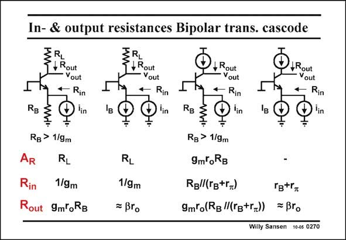

# SANSEN-0270 · In- & output resistances Bipolar trans. cascode

章节：02 放大器、源极跟随器与共源共栅级  
PDF 页：85；书本页：86；幻灯片编号：0270  
状态：unreviewed



## Spectre 仿真

本推导组的代表模型已完成 Spectre 验证；覆盖范围以所列网表为准，未逐一搭建所有幻灯片电路。

[本组波形与仿真报告](../../simulations/ch02/index.html#20-port-summary)

## 第二章公式推导

用测试源核对有限 β、输入电阻与带局部负反馈的放大级的输出电阻，避免把表格破折号当零。

[完整 Markdown 解释](../../derivations/ch02/20-port-summary.md) · [排版公式网页](../../derivations/ch02/20-port-summary.html)

状态：derived_in_stated_model；SFG：not_needed。此组以微分、KCL 或矩阵即可说明机制，没有必要另画 SFG。

模型、近似与来源差异以新推导页为准；下方保留第一步的原始抽取。

## 对应教材讲解

### PDF 85 · 书本 86

Finally, the gains, input and output impedances are given for a bipolar transistor cascode. They are clearly even more important than with a MOST.

## 公式／性能结论候选摘录

以下为规则截取的原文，尚未逐项判读。

（未由规则找到；不代表原页没有此类内容。）

## 曲线结论候选摘录

以下为规则截取的原文，尚未逐项判读。

（未由规则找到；不代表原页没有此类内容。）

## 原文条件与近似候选摘录

以下为规则截取的原文，尚未逐项判读。

（未由规则找到；不代表原页没有此类内容。）

## 幻灯片 OCR（未校正）

```text
In- & output resistances Bipolar trans. cascode
RB
ERL
fRout
Yout
1 Rin
lin
Rg > 1/gm
AR
Rin
Rout
1/9m
9moRB
Iв
SRL
{1Rout
- Vout
Rin
lin
RL
1/9m
= Bro
RB
+ Rout
Yout
Rin
'in
RB > 1/9m
9mrRB
Iв
÷
„Rout
Yout
Rin
Đ
-
Rgl(rв+г,)
Гв+rт
9mro(Rg"(rвtr_)) = Bro
Willy Sansen 10-05 0270
```

数学上下标、分数及正负号以原图为准。电路图已保留；未核对的连接不输出成可仿真 netlist。
