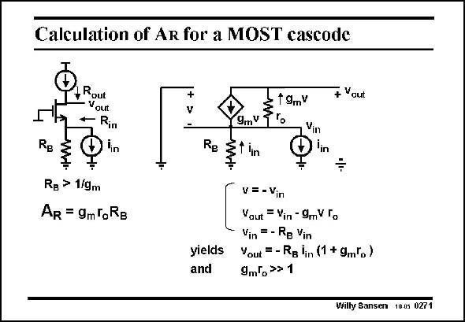

# SANSEN-0271 · Calculation of Ar for a MOST cascode

章节：02 放大器、源极跟随器与共源共栅级  
PDF 页：86；书本页：87；幻灯片编号：0271  
状态：unreviewed



## Spectre 仿真

本推导组的代表模型已完成 Spectre 验证；覆盖范围以所列网表为准，未逐一搭建所有幻灯片电路。

[本组波形与仿真报告](../../simulations/ch02/index.html#12-common-gate)

## 第二章公式推导

先固定测试电流方向与负载端接，再由同一组 KCL 得三种端口量。

[完整 Markdown 解释](../../derivations/ch02/12-common-gate.md) · [排版公式网页](../../derivations/ch02/12-common-gate.html)

状态：derived_in_stated_model；SFG：not_needed。此组以微分、KCL 或矩阵即可说明机制，没有必要另画 SFG。

模型、近似与来源差异以新推导页为准；下方保留第一步的原始抽取。

## 对应教材讲解

### PDF 86 · 书本 87

All calculations have been carried out by substituting the transistor by its smallsignal equivalent circuit (with only g and r ), and m o solving the Kirchoff equations. An example is given in this slide. It is the derivation of the transresistance (output voltage to input current ratio) of a MOST cascode. Note that a DC current source can simply be omitted in the small-signal equivalent circuit whereas a DC voltage source is simply a short.

## 公式／性能结论候选摘录

以下为规则截取的原文，尚未逐项判读。

（未由规则找到；不代表原页没有此类内容。）

## 曲线结论候选摘录

以下为规则截取的原文，尚未逐项判读。

（未由规则找到；不代表原页没有此类内容。）

## 原文条件与近似候选摘录

以下为规则截取的原文，尚未逐项判读。

（未由规则找到；不代表原页没有此类内容。）

## 幻灯片 OCR（未校正）

```text
Calculation of Ar for a MOST cascode
Rout
Vour
Rin
+ Vout
RB
Rg > 1/gm
AR = 9mrRB
Re
yields
and
1 9mV
9mV
$
Vin
in
5
v= - Vin
Vaut = Vin - 9mV Гo
Vin = - Rg Vin
Yout = - Re lin (1 + 9mrb )
9m>>1
Willy Sanser 10.05 0271
```

数学上下标、分数及正负号以原图为准。电路图已保留；未核对的连接不输出成可仿真 netlist。
