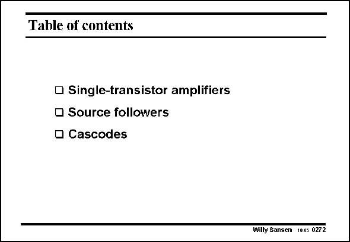

# SANSEN-0272 · Table of contents

章节：02 放大器、源极跟随器与共源共栅级  
PDF 页：86；书本页：87；幻灯片编号：0272  
状态：unreviewed



## 第二章公式推导

由单管结构转向电流镜与差分对的章末目录页；无独立待推导公式。

[完整 Markdown 解释](../../derivations/ch02/00-conventions.md) · [排版公式网页](../../derivations/ch02/00-conventions.html)

状态：context_reviewed_no_independent_derivation；SFG：not_applicable。本页为章节脉络，无独立小信号模型需建图。

模型、近似与来源差异以新推导页为准；下方保留第一步的原始抽取。

## 对应教材讲解

### PDF 86 · 书本 87

Now that we know nearly everything about the three single-transistor configurations, it is time to have a look at the elementary twotransistor configurations. The first one is a current mirror, this is followed by a differential pair. Most of the analog electronics can be built up by means of these two elementary circuits.

## 公式／性能结论候选摘录

以下为规则截取的原文，尚未逐项判读。

（未由规则找到；不代表原页没有此类内容。）

## 曲线结论候选摘录

以下为规则截取的原文，尚未逐项判读。

（未由规则找到；不代表原页没有此类内容。）

## 原文条件与近似候选摘录

以下为规则截取的原文，尚未逐项判读。

（未由规则找到；不代表原页没有此类内容。）

## 幻灯片 OCR（未校正）

```text
Table of contents
• Single-transistor amplifiers
• Source followers
• Cascodes
Willy Sansen 10.05 0272
```

数学上下标、分数及正负号以原图为准。电路图已保留；未核对的连接不输出成可仿真 netlist。
