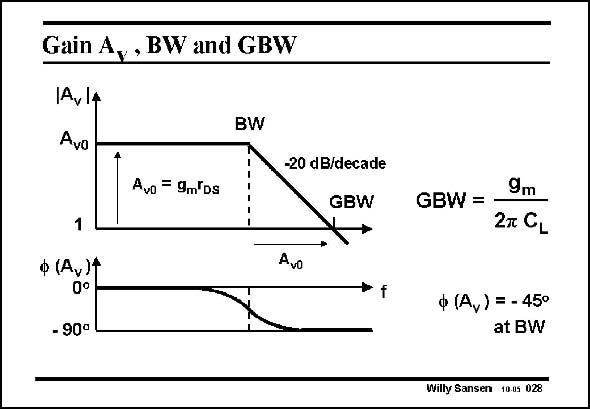
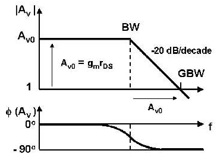

# SANSEN-028 · 增益、带宽与增益带宽积的关系

章节：02 放大器、源极跟随器与共源共栅级  
PDF 页：53；书本页：54；幻灯片编号：028  
状态：representative_case_visually_reviewed



## Spectre 仿真

本推导组的代表模型已完成 Spectre 验证；覆盖范围以所列网表为准，未逐一搭建所有幻灯片电路。

[本组波形与仿真报告](../../simulations/ch02/index.html#02-single-pole)

## 第二章公式推导

推导负载电容主极点、交越频率、GBW 与 029 的尺寸例题。

[完整 Markdown 解释](../../derivations/ch02/02-single-pole.md) · [排版公式网页](../../derivations/ch02/02-single-pole.html)

状态：derived_in_stated_model；SFG：not_needed。此组以微分、KCL 或矩阵即可说明机制，没有必要另画 SFG。

模型、近似与来源差异以新推导页为准；下方保留第一步的原始抽取。

## 对应教材讲解

### PDF 53 · 书本 54

To have a better view on how the frequencies BW and GBW are related to the lowfrequency gain, a Bode diagram is included. Such a Bode diagram consists of two diagrams, both versus frequency on a logarithmic scale. The top one shows the logarithm of the amplitude of the gain, denoted by |A |. The bottom v one plots the phase of the gain A . v It is clear that the GBW is indeed the product of A v0 and the BW. At the BW itself, the phase shift is −45°. At higher frequencies however, the phase shift increases to −90°.

## 已核对的抽取

本页以幅频与相频图说明 027 的单极点增益、带宽及增益带宽积之间的关系。

- `A_{v0}=g_m r_{DS}` — 低频增益大小。
- `GBW=\frac{g_m}{2\pi C_L}` — 增益带宽积。
- `\phi(A_v)=-45^\circ\quad\mathrm{at}\ BW` — 幻灯片显示相对低频值的单极点相位延迟。



### 曲线结论

- 幅度渐近线在 BW 后以 −20 dB/decade 下降，并在标成 GBW 的位置穿越单位增益。
- 相位在 BW 处为 −45°，高频趋近 −90°；图中不含共源级的固定反相 180°。

### 条件与近似注记

- 图面判读：折线为波特渐近线，并非极点附近的精确幅度。
- 核对注记：把单位增益交越频率直接标成 GBW，使用了高低频增益差足够大时的近似。

### 连接关系

- 沿用幻灯片 027 的共源级；本页本身没有重画电路。

## 公式／性能结论候选摘录

以下为规则截取的原文，尚未逐项判读。

- PDF 53: To have a better view on how the frequencies BW and GBW are related to the lowfrequency gain, a Bode diagram is included.
- PDF 53: The top one shows the logarithm of the amplitude of the gain, denoted by |A |.
- PDF 53: The bottom v one plots the phase of the gain A . v It is clear that the GBW is indeed the product of A v0 and the BW.
- PDF 53: At higher frequencies however, the phase shift increases to −90°.

## 曲线结论候选摘录

以下为规则截取的原文，尚未逐项判读。

- PDF 53: To have a better view on how the frequencies BW and GBW are related to the lowfrequency gain, a Bode diagram is included.
- PDF 53: Such a Bode diagram consists of two diagrams, both versus frequency on a logarithmic scale.
- PDF 53: The bottom v one plots the phase of the gain A . v It is clear that the GBW is indeed the product of A v0 and the BW.
- PDF 53: At the BW itself, the phase shift is −45°.
- PDF 53: At higher frequencies however, the phase shift increases to −90°.

## 原文条件与近似候选摘录

以下为规则截取的原文，尚未逐项判读。

（未由规则找到；不代表原页没有此类内容。）

## 幻灯片 OCR（未校正）

```text
Gain A,, BW and GBW
1A,l4
BW
Avo
Avo = 9mDs
-20 dB/decade
GBW
1
Ф (А,)*
0°
- 90°
Avo
GBW =
9m
27 CL
ф (A,) = - 45°
at BW
Willy Sansen 10.05 028
```

数学上下标、分数及正负号以原图为准。电路图已保留；未核对的连接不输出成可仿真 netlist。
