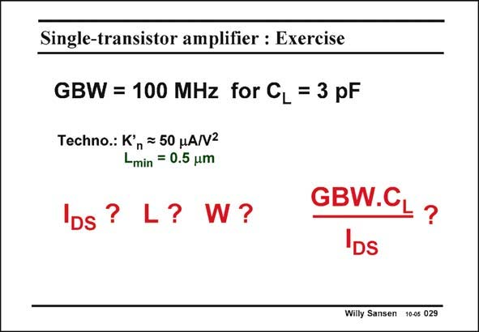

# SANSEN-029 · Single-transistor amplifier : Exercise

章节：02 放大器、源极跟随器与共源共栅级  
PDF 页：54；书本页：55；幻灯片编号：029  
状态：unreviewed



## Spectre 仿真

本推导组的代表模型已完成 Spectre 验证；覆盖范围以所列网表为准，未逐一搭建所有幻灯片电路。

[本组波形与仿真报告](../../simulations/ch02/index.html#02-single-pole)

## 第二章公式推导

推导负载电容主极点、交越频率、GBW 与 029 的尺寸例题。

[完整 Markdown 解释](../../derivations/ch02/02-single-pole.md) · [排版公式网页](../../derivations/ch02/02-single-pole.html)

状态：derived_in_stated_model；SFG：not_needed。此组以微分、KCL 或矩阵即可说明机制，没有必要另画 SFG。

模型、近似与来源差异以新推导页为准；下方保留第一步的原始抽取。

## 对应教材讲解

### PDF 54 · 书本 55

As an exercise, let us design a single-transistor amplifier for a GBW=100 MHz and a C =3 pF. L The technology is shown in this slide. The minimum channel length is 0.5 mm. The required g is readily m calculated to be about 2 mS (or 2 mMhos). We choose V −V = GS T 0.2 V. This transconductance of 2 mS thus requires 0.2 mA current. Using the current expression in strong inversion yields W/L=100. We choose L#4×L =2 mm, to obtain some gain. min As a result W=200 mm. The FOM is 1500 MHzpF/mA, which is not bad! After all only one transistor is involved!! Most opamps later on will have FOMs between 100 and 200, at least the better ones!

## 公式／性能结论候选摘录

以下为规则截取的原文，尚未逐项判读。

- PDF 54: This transconductance of 2 mS thus requires 0.2 mA current.
- PDF 54: We choose L#4×L =2 mm, to obtain some gain. min As a result W=200 mm.

## 曲线结论候选摘录

以下为规则截取的原文，尚未逐项判读。

（未由规则找到；不代表原页没有此类内容。）

## 原文条件与近似候选摘录

以下为规则截取的原文，尚未逐项判读。

（未由规则找到；不代表原页没有此类内容。）

## 幻灯片 OCR（未校正）

```text
Single-transistor amplifier : Exercise
GBW = 100 MHz for CL = 3 pF
Techno.: K'
n = 50 HANV2
Lmin
= 0.5 um
DS
?
L? W?
GBW.C
IDs
?
Willy Sansen 10-05 029
```

数学上下标、分数及正负号以原图为准。电路图已保留；未核对的连接不输出成可仿真 netlist。
