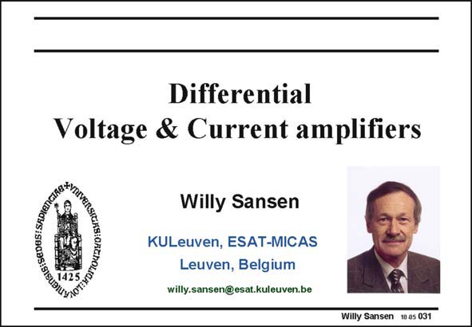

# SANSEN-031 · Slide 031

章节：03 差分电压放大器与电流放大器  
PDF 页：87；书本页：89；幻灯片编号：031  
状态：unreviewed



## 对应教材讲解

### PDF 87 · 书本 89

All analog circuits are built up by use of a very limited number of elementary building blocks. Thorough knowledge of these simple blocks is therefore essential in obtaining insight into more complicated circuit schematics. This is why they are considered separately and analyzed in great detail. We now have a complete knowledge of single-transistor circuits. Now we will concentrate on the study of current mirrors and differential pair. These form the cornerstone of all analog design.

## 公式／性能结论候选摘录

以下为规则截取的原文，尚未逐项判读。

- PDF 87: All analog circuits are built up by use of a very limited number of elementary building blocks.
- PDF 87: Thorough knowledge of these simple blocks is therefore essential in obtaining insight into more complicated circuit schematics.

## 曲线结论候选摘录

以下为规则截取的原文，尚未逐项判读。

（未由规则找到；不代表原页没有此类内容。）

## 原文条件与近似候选摘录

以下为规则截取的原文，尚未逐项判读。

（未由规则找到；不代表原页没有此类内容。）

## 幻灯片 OCR（未校正）

```text
Differential
Voltage & Current amplifiers
Bis:SeDaS:SAD10)
Willy Sansen
KULeuven, ESAT-MICAS
Leuven, Belgium
willy.sansen@esat.kuleuven.be
Willy Sansen 10 as 031
```

数学上下标、分数及正负号以原图为准。电路图已保留；未核对的连接不输出成可仿真 netlist。
