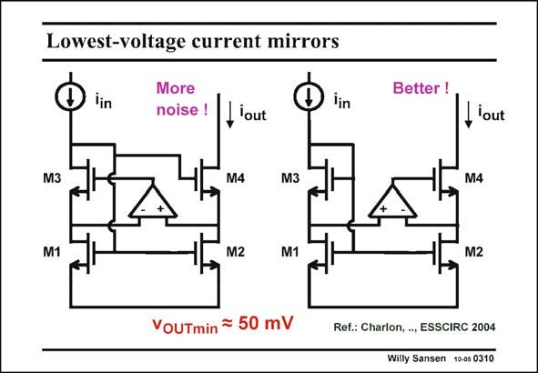

# SANSEN-0310 · Lowest-voltage current mirrors

章节：03 差分电压放大器与电流放大器  
PDF 页：91；书本页：93；幻灯片编号：0310  
状态：unreviewed



## 对应教材讲解

### PDF 91 · 书本 93

Two current mirrors are shown which exploit the opamp for both purposes, i.e. to reduce the compliance voltage as much as possible and also to increase the output resistance as much as possible. Both of them are derived from the 4- transistor current source described previously. The difference is that an opamp is either added to the left cascode or to the right cascode. On the right one, it is fairly easy to see that gain boosting is applied to the right cascode, increasing the output resistance by the gain of that opamp. It is not so obvious that the compliance voltage can be as low as a few tens of mV’s. Indeed the gain of the feedback loop is so high, due to the opamp, that the transistors M1 and M2 can enter the linear region. Moreover cascode transistor M4 can also enter the linear region. The output resistance will be reduced but the opamp provides sufficient gain to compensate for this loss in output resistance.

## 公式／性能结论候选摘录

以下为规则截取的原文，尚未逐项判读。

- PDF 91: Two current mirrors are shown which exploit the opamp for both purposes, i.e. to reduce the compliance voltage as much as possible and also to increase the output resistance as much as possible.
- PDF 91: On the right one, it is fairly easy to see that gain boosting is applied to the right cascode, increasing the output resistance by the gain of that opamp.
- PDF 91: Indeed the gain of the feedback loop is so high, due to the opamp, that the transistors M1 and M2 can enter the linear region.
- PDF 91: The output resistance will be reduced but the opamp provides sufficient gain to compensate for this loss in output resistance.

## 曲线结论候选摘录

以下为规则截取的原文，尚未逐项判读。

（未由规则找到；不代表原页没有此类内容。）

## 原文条件与近似候选摘录

以下为规则截取的原文，尚未逐项判读。

（未由规则找到；不代表原页没有此类内容。）

## 幻灯片 OCR（未校正）

```text
Lowest-voltage current mirrors
lin
More
noise !
lout
lin
Better !
,lout
M3
M4
M3
M4
M1
M2
M1
M2
VOUTmin = 50 mV
Ref.: Charlon, ., ESSCIRC 2004
Willy Sansen 10-05 0310
```

数学上下标、分数及正负号以原图为准。电路图已保留；未核对的连接不输出成可仿真 netlist。
