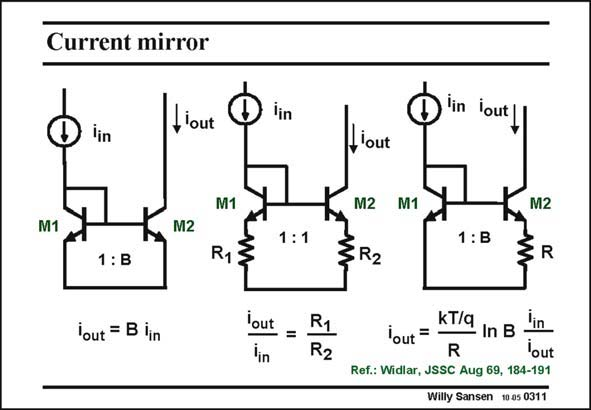

# SANSEN-0311 · Current mirror

章节：03 差分电压放大器与电流放大器  
PDF 页：92；书本页：94；幻灯片编号：0311  
状态：unreviewed



## 对应教材讲解

### PDF 92 · 书本 94

All MOST current sources can be duplicated with bipolar transistors. Historically, the bipolar ones were developed first and the MOST circuits were copies of the bipolar ones. The first one is very conventional current mirror. The second one uses series resistors to set the current ratio’s to the resistor ratio, instead of the transistor ratio. It is easier to make a current ratio more accurate (see Chapter 12). In MOST current mirrors there is no need to include in series resistors, as increasing the V −V values has the same effect (see next Chapter). GS T Moreover, the output resistance is increased by use of the series resistors. The third circuit is not a current mirror but a current reference. Indeed, leaving out one of the two resistors, and taking M2 a factor B larger than M1, provides an output current that is independent of the input current, at least if we use another current mirror on top to ensure that i =i . This will all be repeated in Chapter 13. out in

## 公式／性能结论候选摘录

以下为规则截取的原文，尚未逐项判读。

- PDF 92: GS T Moreover, the output resistance is increased by use of the series resistors.
- PDF 92: Indeed, leaving out one of the two resistors, and taking M2 a factor B larger than M1, provides an output current that is independent of the input current, at least if we use another current mirror on top to ensure that i =i .

## 曲线结论候选摘录

以下为规则截取的原文，尚未逐项判读。

（未由规则找到；不代表原页没有此类内容。）

## 原文条件与近似候选摘录

以下为规则截取的原文，尚未逐项判读。

（未由规则找到；不代表原页没有此类内容。）

## 幻灯片 OCR（未校正）

```text
Current mirror
lin
, lout
lin
lin lout
Llout
M1
M2
1:B
M1
R13
1:1
M2 M1
}R2
1:B
M2
R
lout = B lin
lout
'in
=
R1
R2
kT/q
lout =
In B
lin
R
'out
Ref.: Widlar, JSSC Aug 69, 184-191
Willy Sansen 10 a5 0311
```

数学上下标、分数及正负号以原图为准。电路图已保留；未核对的连接不输出成可仿真 netlist。
