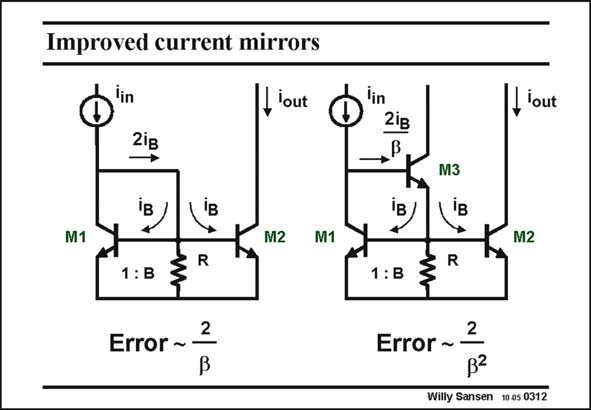

# SANSEN-0312 · Improved current mirrors

章节：03 差分电压放大器与电流放大器  
PDF 页：92；书本页：94；幻灯片编号：0312  
状态：unreviewed



## 对应教材讲解

### PDF 92 · 书本 94

One additional problem is encountered with bipolar transistors: they carry a base current i . B These base currents are both subtracted from the input current source. The error between output and input current is thus about 2/b. We assume resistor R to be really large. Addition of another transistor M3 reduces this error by the another beta. Even for small beta values, this error can be made small. The role of this resistor is then more clear. It increases the current in transistor M3. This will increase its beta somewhat. Indeed, in some older bipolar technologies, the beta drops rapidly

### PDF 93 · 书本 95

for small collector currents. In BiCMOS technologies however, the processing is a lot cleaner. The beta hardly drops at low currents and this resistor can then be omitted. In a BiCMOS technology, a MOST could be used for transistor M3. Its Gate current is zero and so would be the current error. We have to be careful however with the M1, M3 feedback loop. If we reduce the capacitance C too much, by replacing it with a small MOST, we may BE3 find some peaking in the current transfer function, as a result of too many poles too close together! A pole-zero position diagram of the current gain with C as a variable is the best BE3 way to study this phenomenon.

## 公式／性能结论候选摘录

以下为规则截取的原文，尚未逐项判读。

- PDF 92: The error between output and input current is thus about 2/b.
- PDF 92: It increases the current in transistor M3.
- PDF 92: This will increase its beta somewhat.
- PDF 93: If we reduce the capacitance C too much, by replacing it with a small MOST, we may BE3 find some peaking in the current transfer function, as a result of too many poles too close together!
- PDF 93: A pole-zero position diagram of the current gain with C as a variable is the best BE3 way to study this phenomenon.

## 曲线结论候选摘录

以下为规则截取的原文，尚未逐项判读。

- PDF 93: If we reduce the capacitance C too much, by replacing it with a small MOST, we may BE3 find some peaking in the current transfer function, as a result of too many poles too close together!

## 原文条件与近似候选摘录

以下为规则截取的原文，尚未逐项判读。

- PDF 92: We assume resistor R to be really large.

## 幻灯片 OCR（未校正）

```text
Improved current mirrors
'in
2ie
, 'out
M1
M1
R
1:B
2
Error ~
I 'out
2iв
→,B
M3
M2
R
1:B
Error ~ 2
B2
Willy Sansen 10 as 0312
```

数学上下标、分数及正负号以原图为准。电路图已保留；未核对的连接不输出成可仿真 netlist。
