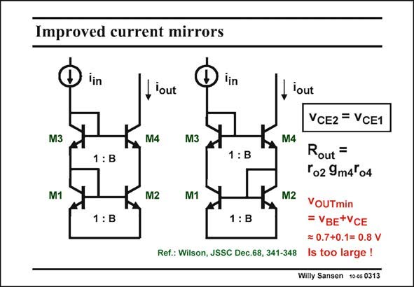

# SANSEN-0313 · Improved current mirrors

章节：03 差分电压放大器与电流放大器  
PDF 页：93；书本页：95；幻灯片编号：0313  
状态：unreviewed



## 对应教材讲解

### PDF 93 · 书本 95

The same techniques can be used as before to make the current difference zero. Two transistors M3 and M4 are added, which have as a first objective to make the voltages v across the current CE mirror devices M1 and M2 as equal as possible. We have again two realizations. The left one is a passive circuit as it consists of a voltage divider utilizing two diode connected transistors M1 and M3, connected to a cascoded amplifier M2 and M4. Transistors M4 and M2 have the same W/L ratio as M2 and M1, which is B. Transistors M3 and M4 must have the same V because their currents have the same ratio B. As a result, the BE voltages v and v must also be the same. The current ratio will therefore be quite accurate. CE1 CE2 The same is true for the current mirror on the right. It is an active circuit however. It is a feedback amplifier with loop gain T. Multiple poles occur, leading to peaking in the current transfer characteristic. An important disadvantage of both current mirrors, is again that their minimum output voltage (compliance voltage) is quite high! As a result they cannot be used in low-voltage applications! One of the low-voltage current mirrors should be used!

## 公式／性能结论候选摘录

以下为规则截取的原文，尚未逐项判读。

- PDF 93: Two transistors M3 and M4 are added, which have as a first objective to make the voltages v across the current CE mirror devices M1 and M2 as equal as possible.
- PDF 93: As a result, the BE voltages v and v must also be the same.
- PDF 93: The current ratio will therefore be quite accurate.
- PDF 93: It is a feedback amplifier with loop gain T.
- PDF 93: As a result they cannot be used in low-voltage applications!

## 曲线结论候选摘录

以下为规则截取的原文，尚未逐项判读。

- PDF 93: Multiple poles occur, leading to peaking in the current transfer characteristic.

## 原文条件与近似候选摘录

以下为规则截取的原文，尚未逐项判读。

（未由规则找到；不代表原页没有此类内容。）

## 幻灯片 OCR（未校正）

```text
Improved current mirrors
lin
lin
-lout
M3
M4
M3
1:B
1: B
M1
M2
M1
1 : B
1: B
Ref.: Wilson, JSSC Dec.68, 341-348
lout
M4
M2
VCE2 = VCE1
Rout =
Ґo2 9m4'04
VOUTmin
= VBE*VCE
= 0.7+0.1= 0.8 V
Is too large !
Willy Sansen 10-05 0313
```

数学上下标、分数及正负号以原图为准。电路图已保留；未核对的连接不输出成可仿真 netlist。
