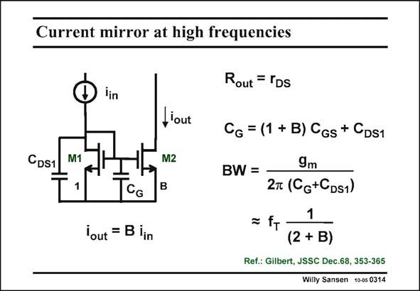

# SANSEN-0314 · Current mirror at high frequencies

章节：03 差分电压放大器与电流放大器  
PDF 页：94；书本页：96；幻灯片编号：0314  
状态：unreviewed



## 对应教材讲解

### PDF 94 · 书本 96

Let us now have a closer look at the high-frequency performance. The most important capacitances are shown explicitly. The C of tran- GS sistor M2 is obviously B times larger than the one of transistor M1. This is why the total capacitance at the inner node is C . G Again we assume C to DS1 be very similar in size to C . As a result, the band- GS width of this current amplifier, with current gain B, is again a fraction of f . T If we design the two MOSTs with large V −V and smallest possible channel length L, then GS T a very high bandwidth can be expected.

## 公式／性能结论候选摘录

以下为规则截取的原文，尚未逐项判读。

- PDF 94: As a result, the band- GS width of this current amplifier, with current gain B, is again a fraction of f .
- PDF 94: T If we design the two MOSTs with large V −V and smallest possible channel length L, then GS T a very high bandwidth can be expected.

## 曲线结论候选摘录

以下为规则截取的原文，尚未逐项判读。

（未由规则找到；不代表原页没有此类内容。）

## 原文条件与近似候选摘录

以下为规则截取的原文，尚未逐项判读。

- PDF 94: G Again we assume C to DS1 be very similar in size to C .

## 幻灯片 OCR（未校正）

```text
Current mirror at high frequencies
CDS1
lin
H'out
M1
M2
1
CG
B
lout = B iin
Rout = TDS
CG = (1 + B) CGs + CDs1
BW =
9m
2m (Cg+CDs1)
1
= fr-
(2 + B)
Ref.: Gilbert, JSSC Dec.68, 353-365
Willy Sansen 100s 0314
```

数学上下标、分数及正负号以原图为准。电路图已保留；未核对的连接不输出成可仿真 netlist。
