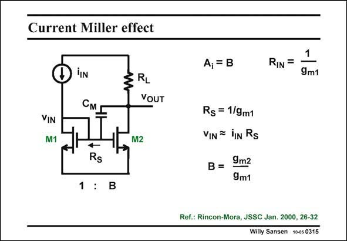

# SANSEN-0315 · Current Miller effect

章节：03 差分电压放大器与电流放大器  
PDF 页：94；书本页：96；幻灯片编号：0315  
状态：unreviewed



## 对应教材讲解

### PDF 94 · 书本 96

Such a current mirror or amplifier can also cause capacitance multiplication by the Miller effect, very much as a voltage amplifier causes capacitance multiplication. The Miller capacitance is C , and is connected from M the voltage output, realized by means of a load resistor, and the middle point. The current gain is again B. The input resistance is again 1/g . It serves as a m1 source resistor for the RS amplifying transistor. For the calculation of the capacitance multiplication, we simplify the circuit, as shown next.

## 公式／性能结论候选摘录

以下为规则截取的原文，尚未逐项判读。

- PDF 94: The current gain is again B.

## 曲线结论候选摘录

以下为规则截取的原文，尚未逐项判读。

（未由规则找到；不代表原页没有此类内容。）

## 原文条件与近似候选摘录

以下为规则截取的原文，尚未逐项判读。

（未由规则找到；不代表原页没有此类内容。）

## 幻灯片 OCR（未校正）

```text
Current Miller effect
RL
YOUT
CMI
VIN
M1
M2
Rs
1 : B
A, = B
RIN =
1
9m1
Rg = 1/gm1
VIN = TIN RS
B= 9mz
9m1
Ref.: Rincon-Mora, JSSC Jan. 2000, 26-32
Willy Sansen 1905 0315
```

数学上下标、分数及正负号以原图为准。电路图已保留；未核对的连接不输出成可仿真 netlist。
