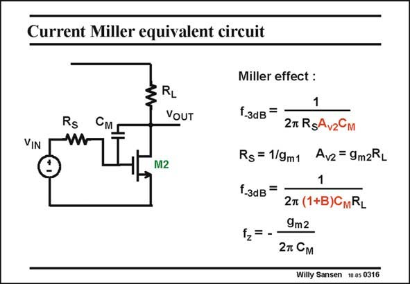

# SANSEN-0316 · Current Miller equivalent circuit

章节：03 差分电压放大器与电流放大器  
PDF 页：95；书本页：97；幻灯片编号：0316  
状态：unreviewed



## 对应教材讲解

### PDF 94 · 书本 96

The bandwidth denoted by f is now readily calculated. –3dB It clearly shows that capacitance C is indeed multiplied by the voltage gain A . This latter M v2 gain is also determined by current gain factor B.

### PDF 95 · 书本 97

There is also a zero as for the voltage Miller effect (see Chapter 2). This zero occurs at real high frequencies however and is usually negligible. This phenomenon is called the current Miller effect. It will be used to realize large capacitances on a chip. A well known application is the compensation of operational amplifiers (see Chapter 5).

## 公式／性能结论候选摘录

以下为规则截取的原文，尚未逐项判读。

- PDF 94: The bandwidth denoted by f is now readily calculated. –3dB It clearly shows that capacitance C is indeed multiplied by the voltage gain A .
- PDF 94: This latter M v2 gain is also determined by current gain factor B.

## 曲线结论候选摘录

以下为规则截取的原文，尚未逐项判读。

（未由规则找到；不代表原页没有此类内容。）

## 原文条件与近似候选摘录

以下为规则截取的原文，尚未逐项判读。

（未由规则找到；不代表原页没有此类内容。）

## 幻灯片 OCR（未校正）

```text
Current Miller equivalent circuit
VIN
Rs
RL
VOUT
M2
Miller effect :
1
f.зав=
27 RgAvzCM
Rs = 1/9m1 Avz = 9m2RL
1
f.3dB=
2т (1+B)CmRL
9m2
f2= -
2 Cм
Willy Sansen 10 0s 0316
```

数学上下标、分数及正负号以原图为准。电路图已保留；未核对的连接不输出成可仿真 netlist。
