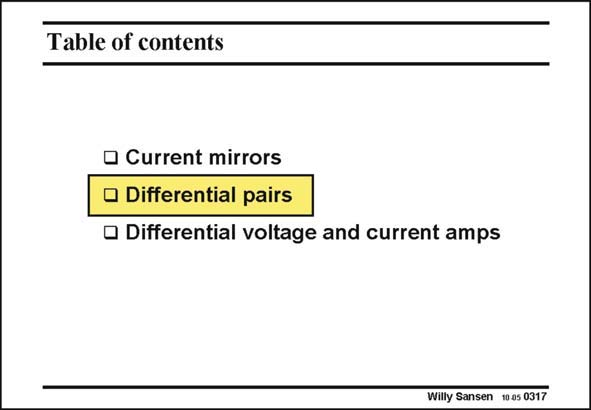

# SANSEN-0317 · Table of contents

章节：03 差分电压放大器与电流放大器  
PDF 页：95；书本页：97；幻灯片编号：0317  
状态：unreviewed



## 对应教材讲解

### PDF 95 · 书本 97

The second and more important two-transistor elementary circuit is a differential pair. Actually, it is two single-transistor amplifiers in parallel, in order to reject disturbing commonmode signals. It will thus be the basis for all fullydifferential circuits. In mixed-signal circuitry, only fully-differential circuits can be allowed, in order to reject ground noise, supply line spikes, etc. First of all, wee start with a simple differential pair. Addition of two load resistors yields a voltage differential amplifier

## 公式／性能结论候选摘录

以下为规则截取的原文，尚未逐项判读。

- PDF 95: It will thus be the basis for all fullydifferential circuits.

## 曲线结论候选摘录

以下为规则截取的原文，尚未逐项判读。

（未由规则找到；不代表原页没有此类内容。）

## 原文条件与近似候选摘录

以下为规则截取的原文，尚未逐项判读。

（未由规则找到；不代表原页没有此类内容。）

## 幻灯片 OCR（未校正）

```text
Table of contents
• Current mirrors
• Differential pairs
• Differential voltage and current amps
Willy Sansen 10 0s 0317
```

数学上下标、分数及正负号以原图为准。电路图已保留；未核对的连接不输出成可仿真 netlist。
