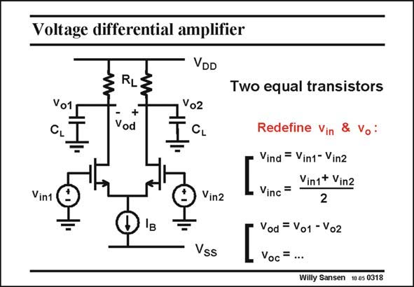

# SANSEN-0318 · Voltage differential amplifier

章节：03 差分电压放大器与电流放大器  
PDF 页：96；书本页：98；幻灯片编号：0318  
状态：unreviewed



## 对应教材讲解

### PDF 95 · 书本 97

In such a voltage differential amplifier, two equal transistors are used and two equal load resistors. We will never be able to make these transistors exactly identical. Small differences will always exist. They will give rise to mismatch, offset, etc. This will be discussed in Chapter 12. In this chapter we will always assume that the transistors are exactly the same and so are the resistors. Such an amplifier is biased by a DC current source I . B There are two input voltages and two output voltages. The input voltages are referred to ground. This is only possible if two supply lines are used, for example V at −5 V and V at SS DD

### PDF 96 · 书本 98

5 V. This total supply voltage of 10 V can also be used as a single supply voltage with respect to ground. In this case however, the inputs voltages must be referred to a DC reference voltage, somewhere between 10 V and ground. Actually, this has now become common. Supply voltages are used such as 1.8 and 2.5 V, depending on the technology. An internal reference must then be derived, for example 1 V, to make sure that the input devices are properly biased. Whatever the input voltages are, we will redefine them, to gain insight into the operation of this circuit. We define the differential input voltage and the common-mode or average input voltage, as shown. The same is true for the two output voltages. We will be interested mainly in the differential output/input voltages!

## 公式／性能结论候选摘录

以下为规则截取的原文，尚未逐项判读。

- PDF 95: In such a voltage differential amplifier, two equal transistors are used and two equal load resistors.
- PDF 96: Supply voltages are used such as 1.8 and 2.5 V, depending on the technology.
- PDF 96: Whatever the input voltages are, we will redefine them, to gain insight into the operation of this circuit.

## 曲线结论候选摘录

以下为规则截取的原文，尚未逐项判读。

（未由规则找到；不代表原页没有此类内容。）

## 原文条件与近似候选摘录

以下为规则截取的原文，尚未逐项判读。

- PDF 95: In this chapter we will always assume that the transistors are exactly the same and so are the resistors.

## 幻灯片 OCR（未校正）

```text
Voltage differential amplifier
Vo1
CL
RL
+
Vod
VDD
Vo2
CL
Vin1
Vin2
Vss
Two equal transistors
Redefine Vin & Vo :
Vind = Vin1- Vin2
Vin1+ Vin2
Vinc =
2
Vod = Vo1 -Vo2
Voc
=
Willy Sansen 10 05 0318
```

数学上下标、分数及正负号以原图为准。电路图已保留；未核对的连接不输出成可仿真 netlist。
