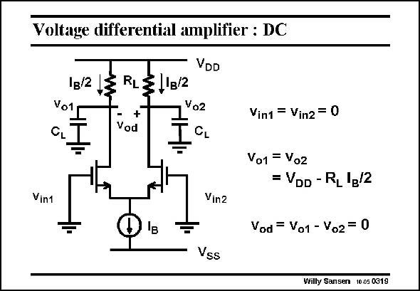

# SANSEN-0319 · Voltage differential amplifier : DC

章节：03 差分电压放大器与电流放大器  
PDF 页：96；书本页：98；幻灯片编号：0319  
状态：unreviewed



## 对应教材讲解

### PDF 96 · 书本 98

Let us first have a closer look at the DC operation. When both input voltages are zero, then both transistors have exactly the same v . They must now have GS the same current. Since the sum of the currents is always I , each transistor must B carry a DC current I /2. B Since both load resistors are the same, the voltages across them must be the same as well. The differential voltage is therefore zero. As could be expected, zero differential input voltage gives zero differential output voltage.

## 公式／性能结论候选摘录

以下为规则截取的原文，尚未逐项判读。

- PDF 96: The differential voltage is therefore zero.

## 曲线结论候选摘录

以下为规则截取的原文，尚未逐项判读。

（未由规则找到；不代表原页没有此类内容。）

## 原文条件与近似候选摘录

以下为规则截取的原文，尚未逐项判读。

（未由规则找到；不代表原页没有此类内容。）

## 幻灯片 OCR（未校正）

```text
Voltage differential amplifier : DC
1B/2
Vo1
CL
RL
+
Vod
VDD
1в/2
Vo2
CL
Vin1
Vin2
Vint = Vin2 = 0
Vo1 = Vo2
= VDD - RL 'g/2
Vod = Vo1 - Vo2 = 0
Vss
Willy Sansen 10.05 0319
```

数学上下标、分数及正负号以原图为准。电路图已保留；未核对的连接不输出成可仿真 netlist。
