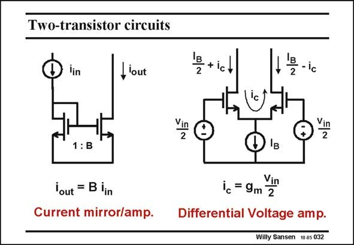

# SANSEN-032 · Two-transistor circuits

章节：03 差分电压放大器与电流放大器  
PDF 页：87；书本页：89；幻灯片编号：032  
状态：unreviewed



## 对应教材讲解

### PDF 87 · 书本 89

A current mirror, in its simplest form, is illustrated on the left. A differential pair is shown on the right. A current mirror is actually a combination of a diode-connected transistor followed by a single-transistor amplifier. The first one converts the input current into a voltage whereas the latter one converts the voltage into a current. The current ratio will be quite accurate, simply because the non-linearity of the diode-connected MOST is compensated by the non-linearity of the amplifying MOST. If the ratio of their W/L’s is B, then the current ratio is also B. Indeed, these MOSTs have the same V and hence V −V . This ratio is the current gain. GS GS T A differential pair consists of two equal transistors, which are both operating as singletransistor amplifiers. The input voltage is differential now, as is the output voltage. We consider the current mirror first.

## 公式／性能结论候选摘录

以下为规则截取的原文，尚未逐项判读。

- PDF 87: This ratio is the current gain.
- PDF 87: GS GS T A differential pair consists of two equal transistors, which are both operating as singletransistor amplifiers.

## 曲线结论候选摘录

以下为规则截取的原文，尚未逐项判读。

（未由规则找到；不代表原页没有此类内容。）

## 原文条件与近似候选摘录

以下为规则截取的原文，尚未逐项判读。

（未由规则找到；不代表原页没有此类内容。）

## 幻灯片 OCR（未校正）

```text
Two-transistor circuits
'in
, lout
Etict
T-ic
Vin
2
1: B
B
2
lout = B lin
Current mirror/amp.
ic = 9m 2
Differential Voltage amp.
Willy Sansen 10 a5 032
```

数学上下标、分数及正负号以原图为准。电路图已保留；未核对的连接不输出成可仿真 netlist。
