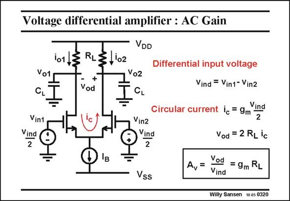

# SANSEN-0320 · Voltage differential amplifier : AC Gain

章节：03 差分电压放大器与电流放大器  
PDF 页：97；书本页：99；幻灯片编号：0320  
状态：unreviewed



## 对应教材讲解

### PDF 96 · 书本 98

When we now apply a differential input voltage, divided equally over both inputs, both input voltages are the same in amplitude, but opposite in sign.

### PDF 97 · 书本 99

If we assume that the left gate voltage increases, then the left transistor current also increases. The right transistor current must decrease by the same amount, as the sum of the currents is still I . B This increase in current is the AC current or rather the circular current. It is added to the current I /2 on the B left and subtracted on the right. It flows as indicated by the arrow. This circular current will now be converted into a differential output voltage v . Indeed, the circular current flows through both load resistors and od develops v . od The gain is now easily calculated. The circular current depends on the input voltage by the transconductance. The output voltage v depends simply on this current. od Note that there are several ‘‘factors of two’’ involved. The resulting expression of the voltage gain is exactly the same as for a single-transistor amplifier. Note also that the AC current circles around through both transistors and load resistors. It does not flow through the supply lines!

## 公式／性能结论候选摘录

以下为规则截取的原文，尚未逐项判读。

- PDF 96: When we now apply a differential input voltage, divided equally over both inputs, both input voltages are the same in amplitude, but opposite in sign.
- PDF 97: If we assume that the left gate voltage increases, then the left transistor current also increases.
- PDF 97: The right transistor current must decrease by the same amount, as the sum of the currents is still I .
- PDF 97: B This increase in current is the AC current or rather the circular current.
- PDF 97: Indeed, the circular current flows through both load resistors and od develops v . od The gain is now easily calculated.
- PDF 97: The circular current depends on the input voltage by the transconductance.
- PDF 97: The output voltage v depends simply on this current. od Note that there are several ‘‘factors of two’’ involved.
- PDF 97: The resulting expression of the voltage gain is exactly the same as for a single-transistor amplifier.

## 曲线结论候选摘录

以下为规则截取的原文，尚未逐项判读。

（未由规则找到；不代表原页没有此类内容。）

## 原文条件与近似候选摘录

以下为规则截取的原文，尚未逐项判读。

- PDF 97: If we assume that the left gate voltage increases, then the left transistor current also increases.

## 幻灯片 OCR（未校正）

```text
Voltage differential amplifier : AC Gain
101
Vo1
CL
Vin1
Vind
2
RL
VDD
1102
+
Vod
Vo2
CL
'c
Vin2
Vind
2
Vss
Differential input voltage
Vind = Vin1- Vin2
Circular current ic = 9m
Vind
2
Vod = 2 RL ic
Av=
Vod
= 9m RL
Vind
Willy Sansen 10 a5 0320
```

数学上下标、分数及正负号以原图为准。电路图已保留；未核对的连接不输出成可仿真 netlist。
