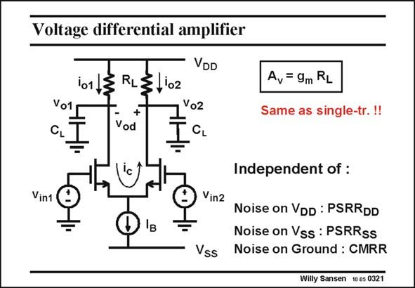

# SANSEN-0321 · Voltage differential amplifier

章节：03 差分电压放大器与电流放大器  
PDF 页：97；书本页：99；幻灯片编号：0321  
状态：unreviewed



## 对应教材讲解

### PDF 97 · 书本 99

The resulting voltage gain has indeed exactly the same expression as for a singletransistor amplifier. The transconductance is now only half however, as the current per transistor is only half (for equal V −V ). GS T The main advantage of this stage is that this voltage gain is completely decoupled from the supply line and ground disturbances. Indeed, noise on the positive supply is also present on both output voltages to ground. It is cancelled out from the differential output voltage. The power-supply rejection ratio will thus be very high. This is in effect, the ratio of two gains, the gain from power supply to the output and the gain from input to output.

### PDF 98 · 书本 100

The same is true for the negative supply V . The same is also true for the ground. Ground SS noise, caused by digital circuits on the same substrate, will be added to both inputs and will thus be rejected by the differential input. As a result the CMRR (Common-mode Rejection Ratio) will be high. All these factors, PSRR and CMRR will be discussed in more detail in Chapter 12. A differential pair is therefore nothing more than a single-transistor amplifier, carried out in a differential way, in order to be able to cope with common-mode disturbances.

## 公式／性能结论候选摘录

以下为规则截取的原文，尚未逐项判读。

- PDF 97: The resulting voltage gain has indeed exactly the same expression as for a singletransistor amplifier.
- PDF 97: The transconductance is now only half however, as the current per transistor is only half (for equal V −V ).
- PDF 97: GS T The main advantage of this stage is that this voltage gain is completely decoupled from the supply line and ground disturbances.
- PDF 97: The power-supply rejection ratio will thus be very high.
- PDF 97: This is in effect, the ratio of two gains, the gain from power supply to the output and the gain from input to output.
- PDF 98: Ground SS noise, caused by digital circuits on the same substrate, will be added to both inputs and will thus be rejected by the differential input.
- PDF 98: As a result the CMRR (Common-mode Rejection Ratio) will be high.
- PDF 98: A differential pair is therefore nothing more than a single-transistor amplifier, carried out in a differential way, in order to be able to cope with common-mode disturbances.

## 曲线结论候选摘录

以下为规则截取的原文，尚未逐项判读。

（未由规则找到；不代表原页没有此类内容。）

## 原文条件与近似候选摘录

以下为规则截取的原文，尚未逐项判读。

（未由规则找到；不代表原页没有此类内容。）

## 幻灯片 OCR（未校正）

```text
Voltage differential amplifier
101
Vo1
CL
RL
+
Vod
VDD
102
Vo2
CL
A. = 9m RL
Same as single-tr.!!
'c
Vin1
Vin2
Vss
Independent of :
Noise on VDD : PSRRDD
Noise on Vss : PSRRss
Noise on Ground : CMRR
Willy Sansen 10 0s 0321
```

数学上下标、分数及正负号以原图为准。电路图已保留；未核对的连接不输出成可仿真 netlist。
