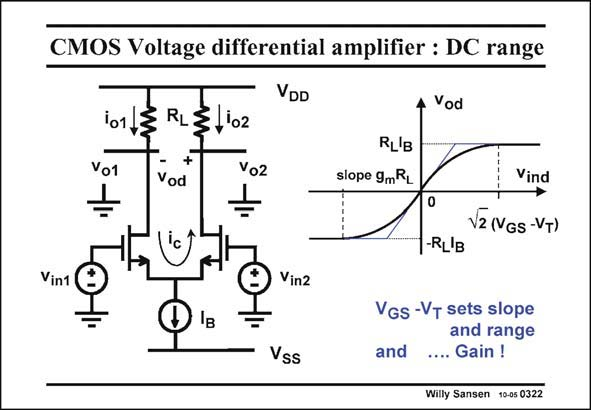

# SANSEN-0322 · CMOS Voltage differential amplifier : DC range

章节：03 差分电压放大器与电流放大器  
PDF 页：98；书本页：100；幻灯片编号：0322  
状态：unreviewed



## 对应教材讲解

### PDF 98 · 书本 100

The output voltage versus input voltage is illustrated in this slide. For small input voltages, the gain is simply g R . It m L is the slope of the characteristic around zero. For larger input voltages, the output level saturates to a voltage R I . For even L B larger input voltages the output voltage is constant. The curve in between is actually a parabola, described by the equation on the previous slide. For small input voltages, the factor under the square root is simply unity. What remains in that expression is simply g . m For an input voltage equal to √2(V −V ) the top of the parabola is reached. The tangent GS T at this point provides a very smooth transition to a constant output voltage. It is clear that V −V is the parameter that controls both the g and the range. For a small GS T m V −V , the gain is high (with a steep slope) but the range is small. For RF receivers a large GS T V −V is preferred; the range is wide but the gain is small. Moreover, a large V −V , provides GS T GS T a highfrequency response.

## 公式／性能结论候选摘录

以下为规则截取的原文，尚未逐项判读。

- PDF 98: For small input voltages, the gain is simply g R .
- PDF 98: What remains in that expression is simply g . m For an input voltage equal to √2(V −V ) the top of the parabola is reached.
- PDF 98: For a small GS T m V −V , the gain is high (with a steep slope) but the range is small.
- PDF 98: For RF receivers a large GS T V −V is preferred; the range is wide but the gain is small.

## 曲线结论候选摘录

以下为规则截取的原文，尚未逐项判读。

- PDF 98: It m L is the slope of the characteristic around zero.
- PDF 98: The curve in between is actually a parabola, described by the equation on the previous slide.
- PDF 98: For a small GS T m V −V , the gain is high (with a steep slope) but the range is small.

## 原文条件与近似候选摘录

以下为规则截取的原文，尚未逐项判读。

- PDF 98: For larger input voltages, the output level saturates to a voltage R I .

## 幻灯片 OCR（未校正）

```text
CMOS Voltage differential amplifier : DC range
VDD
Vod
101
Vo1
+
Vod
,'02
vo2
÷
RL'B
slope 9mRL
ic
0
-RL'B
Vind
V2 (VGs -VT)
Vin1
Vin2
Vss
VGs -VT sets slope
and range
and
.... Gain !
Willy Sansen 10-05 0322
```

数学上下标、分数及正负号以原图为准。电路图已保留；未核对的连接不输出成可仿真 netlist。
