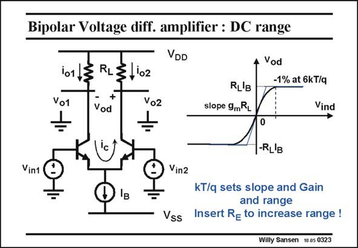

# SANSEN-0323 · Bipolar Voltage diff. amplifier : DC range

章节：03 差分电压放大器与电流放大器  
PDF 页：99；书本页：101；幻灯片编号：0323  
状态：unreviewed



## 对应教材讲解

### PDF 98 · 书本 100

Bipolar transistors have an even lower V −V , or specifically kT/q. The gain is thus very high GS T but the range very small. For small input voltages, the gain is again g R . It is the slope of the m L characteristic around zero. For larger input voltages, the output level saturates again to a voltage R I . For even larger L B input voltages the output voltage is constant. The curve in between consists of exponentials such that a smooth transition is guaranteed. The actual curve will be calculated on the next slide. It is clear that there is no way to control both the g and the range. They are always set by m kT/q. The only way to change this ratio is to insert emitter resistors. The larger the resistor, the wider the range but the smaller the small-signal gain becomes.

## 公式／性能结论候选摘录

以下为规则截取的原文，尚未逐项判读。

- PDF 98: The gain is thus very high GS T but the range very small.
- PDF 98: For small input voltages, the gain is again g R .
- PDF 98: The larger the resistor, the wider the range but the smaller the small-signal gain becomes.

## 曲线结论候选摘录

以下为规则截取的原文，尚未逐项判读。

- PDF 98: It is the slope of the m L characteristic around zero.
- PDF 98: The curve in between consists of exponentials such that a smooth transition is guaranteed.
- PDF 98: The actual curve will be calculated on the next slide.

## 原文条件与近似候选摘录

以下为规则截取的原文，尚未逐项判读。

- PDF 98: For larger input voltages, the output level saturates again to a voltage R I .

## 幻灯片 OCR（未校正）

```text
Bipolar Voltage diff. amplifier : DC range
VDD
Vod
101
Vo1
RL
3,102
+
Vod
RL'B
slope 9mRL
-1% at 6kT/q
Vind
-RL'B
Vin1
Vin2
IB
Vss
kT/q sets slope and Gain
and range
Insert Re to increase range !
Willy Sansen 10 a5 0323
```

数学上下标、分数及正负号以原图为准。电路图已保留；未核对的连接不输出成可仿真 netlist。
