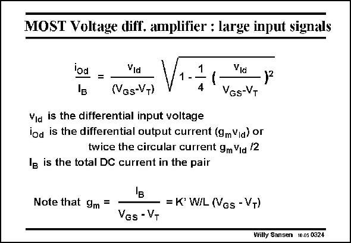

# SANSEN-0324 · MOST Voltage diff. amplifier : large input signals

章节：03 差分电压放大器与电流放大器  
PDF 页：99；书本页：101；幻灯片编号：0324  
状态：unreviewed



## 对应教材讲解

### PDF 99 · 书本 101

When larger input signals are applied, an increasing amount of current flows on one side. For a very large input signal (as for a digital input drive) all current flows in one transistor and the other ones is off. In this case the maximum output voltage is reached, i.e. R I . The L B differential pair therefore also behaves as a limiter, when overdriven. In this case we can no longer use the transconductance, we have to use the full current expressions. Taking into account that – the input voltage v is applied between both v ’s and that Id GS – the sum of the currents is still I , B we can fairly easily find the differential output current i , which is twice the Drain current in Od one transistor. The differential output voltage is then this current multiplied by R . L It is clear that the output voltage is fairly nonlinear, as shown next. We firstly want to derive the transfer characteristic of a differential pair, for comparison purposes.

## 公式／性能结论候选摘录

以下为规则截取的原文，尚未逐项判读。

- PDF 99: The L B differential pair therefore also behaves as a limiter, when overdriven.

## 曲线结论候选摘录

以下为规则截取的原文，尚未逐项判读。

- PDF 99: We firstly want to derive the transfer characteristic of a differential pair, for comparison purposes.

## 原文条件与近似候选摘录

以下为规则截取的原文，尚未逐项判读。

（未由规则找到；不代表原页没有此类内容。）

## 幻灯片 OCR（未校正）

```text
MOST Voltage diff. amplifier : large input signals
iod
=
Vid
(VGs-VT)
1
1 -
4
Vid
VGs-VT
Via is the differential input voltage
iod is the differential output current (9mVia) or
twice the circular current gm Vid /2
Ig is the total DC current in the pair
Note that 9m
'в
=K' W/L (Vgs - VT)
VGs - VT
Willy Sansen 10.05 0324
```

数学上下标、分数及正负号以原图为准。电路图已保留；未核对的连接不输出成可仿真 netlist。
