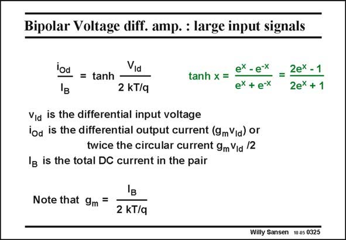

# SANSEN-0325 · Bipolar Voltage diff. amp. : large input signals

章节：03 差分电压放大器与电流放大器  
PDF 页：100；书本页：102；幻灯片编号：0325  
状态：unreviewed



## 对应教材讲解

### PDF 100 · 书本 102

For a differential pair with bipolar transistors, a similar reasoning can be applied. For a large input signal (as for a digital input drive) all current flows in one transistor and the other ones is off. The maximum output voltage is reached, i.e. R I . The L B differential pair therefore behaves as a limiter, when overdriven. In this case we have to use the full current expression. Taking into account that – the input voltage is applied between both v ’s and that BE – the sum of the currents is still I , B we can fairly easily find the differential output current i , which is twice the Collector current Od in one transistor. This expression consists of exponentials. It is clear that this differential output current i is very nonlinear, as shown next. Od

## 公式／性能结论候选摘录

以下为规则截取的原文，尚未逐项判读。

- PDF 100: The L B differential pair therefore behaves as a limiter, when overdriven.

## 曲线结论候选摘录

以下为规则截取的原文，尚未逐项判读。

（未由规则找到；不代表原页没有此类内容。）

## 原文条件与近似候选摘录

以下为规则截取的原文，尚未逐项判读。

（未由规则找到；不代表原页没有此类内容。）

## 幻灯片 OCR（未校正）

```text
Bipolar Voltage diff. amp. : large input signals
lod
= tanh
Vịd
2 kT/q
tanh x =
ex -e-x
= 2ex-1
ex + e-x
2ex + 1
Via is the differential input voltage
iod is the differential output current (9mVia) or
twice the circular current 9m Via /2
In is the total DC current in the pair
Note that 9m =
2 kT/q
Willy Sansen 10 0s 0325
```

数学上下标、分数及正负号以原图为准。电路图已保留；未核对的连接不输出成可仿真 netlist。
