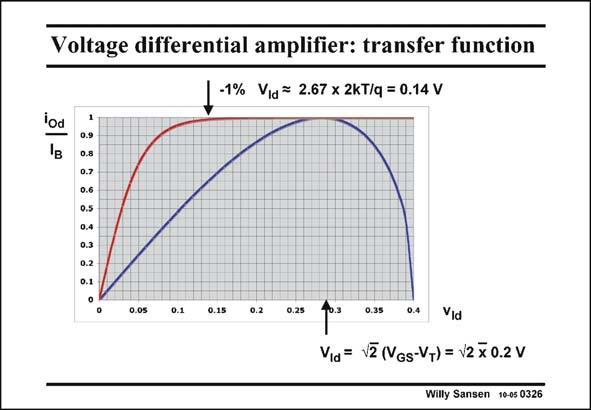

# SANSEN-0326 · Voltage differential amplifier: transfer function

章节：03 差分电压放大器与电流放大器  
PDF 页：100；书本页：102；幻灯片编号：0326  
状态：unreviewed



## 对应教材讲解

### PDF 100 · 书本 102

The differential output current i is plotted for both a Od MOST differential pair (with V −V =0.2 V) and GS T for a bipolar differential pair. For a MOST differential pair, it is clear that this curve is only valid up until v =√2(V −V ) which is Id GS T about 0.283 V in this example. For larger values of v , Id i =I . For small values of Od B the input voltage, the slope is the transconductance g . m For a bipolar differential pair, the effect of the exponentials is clearly seen. The differential output current i reaches its Od final value within 1% after about 6 times kT/q or 0.14 V. If we consider a MOST in moderate inversion with a V −V =52 mV, as for a bipolar GS T transistor, then the transconductances would be the same. The differential output current in the MOST pair then reaches its maximum value I already at √2×52#70 mV, which is 70 mV B earlier than the −1% point of a bipolar differential pair!

## 公式／性能结论候选摘录

以下为规则截取的原文，尚未逐项判读。

（未由规则找到；不代表原页没有此类内容。）

## 曲线结论候选摘录

以下为规则截取的原文，尚未逐项判读。

- PDF 100: The differential output current i is plotted for both a Od MOST differential pair (with V −V =0.2 V) and GS T for a bipolar differential pair.
- PDF 100: For a MOST differential pair, it is clear that this curve is only valid up until v =√2(V −V ) which is Id GS T about 0.283 V in this example.
- PDF 100: For small values of Od B the input voltage, the slope is the transconductance g . m For a bipolar differential pair, the effect of the exponentials is clearly seen.

## 原文条件与近似候选摘录

以下为规则截取的原文，尚未逐项判读。

（未由规则找到；不代表原页没有此类内容。）

## 幻灯片 OCR（未校正）

```text
Voltage differential amplifier: transfer function
_ -1% Via= 2.67 x 2KT/q=0.14 V
iod
0.6
0.5
0.4
0.3
0.2
0.05
0.1
0.15
0.2
0.25
0.35
0.4
Vid
Via = V2 (VGs-VT) = v2 x 0.2 V
Willy Sansen 10-05 0326
```

数学上下标、分数及正负号以原图为准。电路图已保留；未核对的连接不输出成可仿真 netlist。
