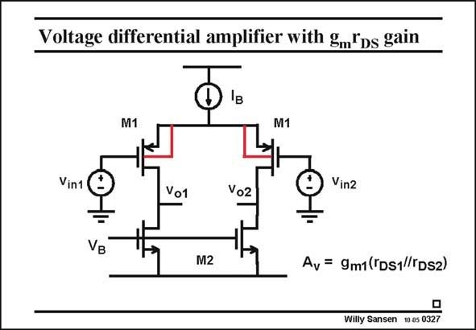

# SANSEN-0327 · Voltage differential amplifier with gmDs gain

章节：03 差分电压放大器与电流放大器  
PDF 页：101；书本页：103；幻灯片编号：0327  
状态：unreviewed



## 对应教材讲解

### PDF 101 · 书本 103

The problem with the previous differential amplifier is that the gain g R is quite m L small. We need larger values of load resistor to increase this gain. For small supply voltages this is not possible. Sometimes resistors are used, when they need to be trimmed to reduce the effect of mismatch. See Chapter 12 for more details. A first solution may be to use the output resistance of a MOST as a load, as shown in this slide. The gain increases to g r , which is all a single transistor can provide. m DS We could also put in cascodes, as shown previously. We will now see two more techniques to enhance the gain. They are current cancellation and bootstrapping. Before we go into detail, we have noticed that the circuit in this slide is not possible from the view of biasing. Both voltage V and current I intend to provide biasing currents to the B B amplifying devices M1. This is not possible. We will have to apply common-mode feedback as explained in Chapter 9. Finally, note that the input devices are pMOSTs, and that their Bulks are connected to their n-well. This is the most common input stage configuration in a n-well CMOS process. Connecting Bulk to Source improves the matching of the input devices, as will be explained in Chapter 12. Note that the Bulk connections are not always shown!

## 公式／性能结论候选摘录

以下为规则截取的原文，尚未逐项判读。

- PDF 101: The problem with the previous differential amplifier is that the gain g R is quite m L small.
- PDF 101: We need larger values of load resistor to increase this gain.
- PDF 101: The gain increases to g r , which is all a single transistor can provide. m DS We could also put in cascodes, as shown previously.
- PDF 101: We will now see two more techniques to enhance the gain.

## 曲线结论候选摘录

以下为规则截取的原文，尚未逐项判读。

（未由规则找到；不代表原页没有此类内容。）

## 原文条件与近似候选摘录

以下为规则截取的原文，尚未逐项判读。

（未由规则找到；不代表原页没有此类内容。）

## 幻灯片 OCR（未校正）

```text
Voltage differential amplifier with gmDs gain
IB
M1
M1
Vin1(
Vo1
Voz
Э
Vin2
VB
M2
Av = 9m1(TDs1//TDS2)
Willy Sansen 10 a5 0327
```

数学上下标、分数及正负号以原图为准。电路图已保留；未核对的连接不输出成可仿真 netlist。
