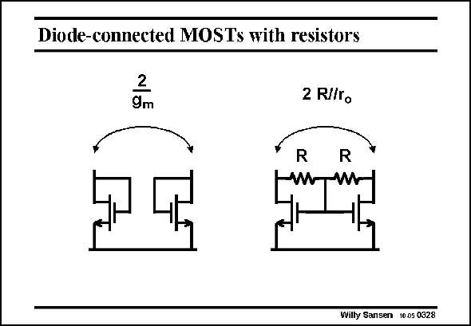

# SANSEN-0328 · Diode-connected MOSTs with resistors

章节：03 差分电压放大器与电流放大器  
PDF 页：101；书本页：103；幻灯片编号：0328  
状态：unreviewed



## 对应教材讲解

### PDF 101 · 书本 103

If large-valued resistors are available, another self-biasing load can be found. It is shown in this slide. Actually, a virtual ground is realized between both transistors. This point does not carry any AC signal. The output resistance will thus be twice what is seen on either side. It is thus twice resistor R in parallel with the output resistance r or r of the transistor. DS o It is not as high as previous. Moreover, we need to

### PDF 102 · 书本 104

be able to identify large resistors in a MOST process. This may be the case in an analog CMOS process but certainly not in a digital one.

## 公式／性能结论候选摘录

以下为规则截取的原文，尚未逐项判读。

- PDF 101: The output resistance will thus be twice what is seen on either side.
- PDF 101: It is thus twice resistor R in parallel with the output resistance r or r of the transistor.

## 曲线结论候选摘录

以下为规则截取的原文，尚未逐项判读。

（未由规则找到；不代表原页没有此类内容。）

## 原文条件与近似候选摘录

以下为规则截取的原文，尚未逐项判读。

（未由规则找到；不代表原页没有此类内容。）

## 幻灯片 OCR（未校正）

```text
Diode-connected MOSTs with resistors
2
9m
2 R//ro
R
R
Willy Sansen 10.05 0328
```

数学上下标、分数及正负号以原图为准。电路图已保留；未核对的连接不输出成可仿真 netlist。
