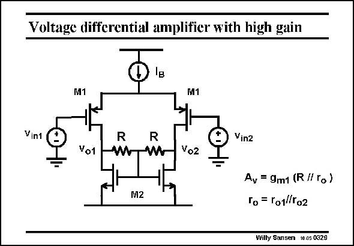

# SANSEN-0329 · Voltage differential amplifier with high gain

章节：03 差分电压放大器与电流放大器  
PDF 页：102；书本页：104；幻灯片编号：0329  
状态：unreviewed



## 对应教材讲解

### PDF 102 · 书本 104

Application of this load to a differential pair, gives the high-gain amplifier shown in this slide. It is clear that the differential output signals are cancelled out at the common-Gate point of the transistors M2. The selfbiasing is actually a case of common-mode feedback, as explained in Chapter 8. The gain is moderately high. There is no biasing problem. Current source I B determines all currents.

## 公式／性能结论候选摘录

以下为规则截取的原文，尚未逐项判读。

- PDF 102: Application of this load to a differential pair, gives the high-gain amplifier shown in this slide.
- PDF 102: The gain is moderately high.

## 曲线结论候选摘录

以下为规则截取的原文，尚未逐项判读。

（未由规则找到；不代表原页没有此类内容。）

## 原文条件与近似候选摘录

以下为规则截取的原文，尚未逐项判读。

（未由规则找到；不代表原页没有此类内容。）

## 幻灯片 OCR（未校正）

```text
Voltage differential amplifier with high gain
M1
M1
Vint
Vo1
R
ww
R
Vin2
Vo2
M2
Av = 9m1 (R /I ro )
To = ro1/To2
Willy Sansen 10.05 0329
```

数学上下标、分数及正负号以原图为准。电路图已保留；未核对的连接不输出成可仿真 netlist。
