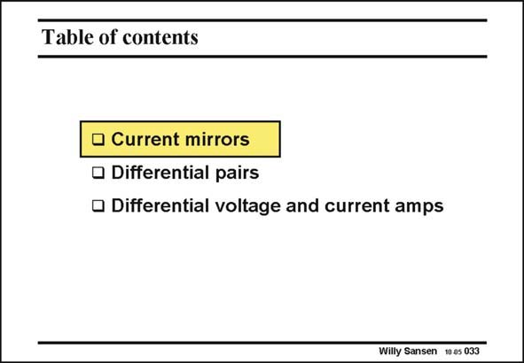

# SANSEN-033 · Table of contents

章节：03 差分电压放大器与电流放大器  
PDF 页：88；书本页：90；幻灯片编号：033  
状态：unreviewed



## 对应教材讲解

### PDF 88 · 书本 90

We begin with the current mirror first because it is a simpler circuit to understand. Later on we will discuss the differential pair as a first full-differential amplifier. It will be followed by many more differential amplifiers. We need them because they are insensitive to substrate noise and ground bounces. They are therefore necessary in all mixed-signal design, where analog circuits are added on the substrate as digital systems.

## 公式／性能结论候选摘录

以下为规则截取的原文，尚未逐项判读。

- PDF 88: They are therefore necessary in all mixed-signal design, where analog circuits are added on the substrate as digital systems.

## 曲线结论候选摘录

以下为规则截取的原文，尚未逐项判读。

（未由规则找到；不代表原页没有此类内容。）

## 原文条件与近似候选摘录

以下为规则截取的原文，尚未逐项判读。

（未由规则找到；不代表原页没有此类内容。）

## 幻灯片 OCR（未校正）

```text
Table of contents
• Current mirrors
• Differential pairs
• Differential voltage and current amps
Willy Sansen 10 as 033
```

数学上下标、分数及正负号以原图为准。电路图已保留；未核对的连接不输出成可仿真 netlist。
