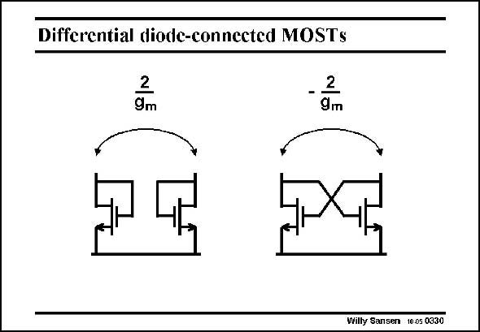

# SANSEN-0330 · Differential diode-connected MOSTs

章节：03 差分电压放大器与电流放大器  
PDF 页：102；书本页：104；幻灯片编号：0330  
状态：unreviewed



## 对应教材讲解

### PDF 102 · 书本 104

Even more gain can be obtained by current cancellation For this purpose, we need to take differential diodeconnected MOSTs. Two of them provide a differential small-signal resistance of 2/g . m Cross coupling them creates a positive feedback amplifier with two stages. As a result the differential resistance becomes negative or −2/g . m This negative resistance is easily controlled through the current. It is often used in oscillators, RF voltage-controlled oscillators and in wideband amplifiers.

## 公式／性能结论候选摘录

以下为规则截取的原文，尚未逐项判读。

- PDF 102: Even more gain can be obtained by current cancellation For this purpose, we need to take differential diodeconnected MOSTs.
- PDF 102: As a result the differential resistance becomes negative or −2/g . m This negative resistance is easily controlled through the current.

## 曲线结论候选摘录

以下为规则截取的原文，尚未逐项判读。

（未由规则找到；不代表原页没有此类内容。）

## 原文条件与近似候选摘录

以下为规则截取的原文，尚未逐项判读。

（未由规则找到；不代表原页没有此类内容。）

## 幻灯片 OCR（未校正）

```text
Differential diode-connected MOSTs
-Zm
Willy Sansen 1005 0330
```

数学上下标、分数及正负号以原图为准。电路图已保留；未核对的连接不输出成可仿真 netlist。
