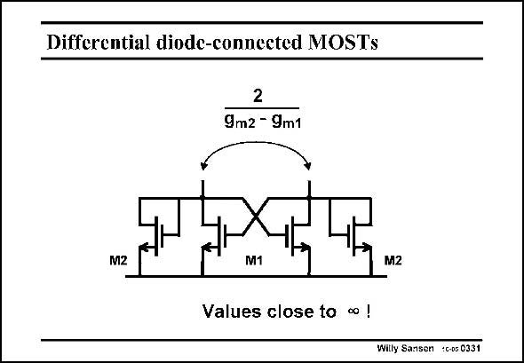

# SANSEN-0331 · Differential diode-connected MOSTs

章节：03 差分电压放大器与电流放大器  
PDF 页：103；书本页：105；幻灯片编号：0331  
状态：unreviewed



## 对应教材讲解

### PDF 103 · 书本 105

Connection of a set of positive diode resistances with negative ones, allows the realization of any resistance between 1/g and infinity. m Making all devices the same cancels the AC current in this circuit, causing the differential to be very high (infinity if matching is perfect). It is therefore an ideal load for a differential amplifier.

## 公式／性能结论候选摘录

以下为规则截取的原文，尚未逐项判读。

- PDF 103: It is therefore an ideal load for a differential amplifier.

## 曲线结论候选摘录

以下为规则截取的原文，尚未逐项判读。

（未由规则找到；不代表原页没有此类内容。）

## 原文条件与近似候选摘录

以下为规则截取的原文，尚未逐项判读。

（未由规则找到；不代表原页没有此类内容。）

## 幻灯片 OCR（未校正）

```text
Differential diode-connected MOSTs
2
9m2 - 9m1
M2
M1
M2
Values close to ∞• !
Willy Sansen +C-os 0331
```

数学上下标、分数及正负号以原图为准。电路图已保留；未核对的连接不输出成可仿真 netlist。
