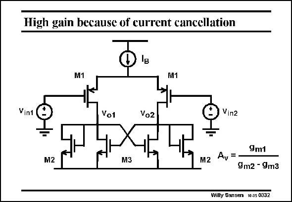

# SANSEN-0332 · High gain because of current cancellation

章节：03 差分电压放大器与电流放大器  
PDF 页：103；书本页：105；幻灯片编号：0332  
状态：unreviewed



## 对应教材讲解

### PDF 103 · 书本 105

Such high-gain amplifier is shown in this slide. All load MOSTs M2 and M3 have equal size. Their transconductances are now also equal. As a result they exhibit quasi-infinite resistance to the input devices, resulting in large voltage gains. The biasing problem is also solved. Only I sets the B currents. This load is said to be self-biasing.

## 公式／性能结论候选摘录

以下为规则截取的原文，尚未逐项判读。

- PDF 103: Such high-gain amplifier is shown in this slide.
- PDF 103: All load MOSTs M2 and M3 have equal size.
- PDF 103: Their transconductances are now also equal.
- PDF 103: As a result they exhibit quasi-infinite resistance to the input devices, resulting in large voltage gains.

## 曲线结论候选摘录

以下为规则截取的原文，尚未逐项判读。

（未由规则找到；不代表原页没有此类内容。）

## 原文条件与近似候选摘录

以下为规则截取的原文，尚未逐项判读。

（未由规则找到；不代表原页没有此类内容。）

## 幻灯片 OCR（未校正）

```text
High gain because of current cancellation
M1
M1
Vint
Vot
Vo2
Vinz
M2
M3
M2
Ay
=
9m1
9m2 - 9m3
Willy Sansen 10.05 0332
```

数学上下标、分数及正负号以原图为准。电路图已保留；未核对的连接不输出成可仿真 netlist。
