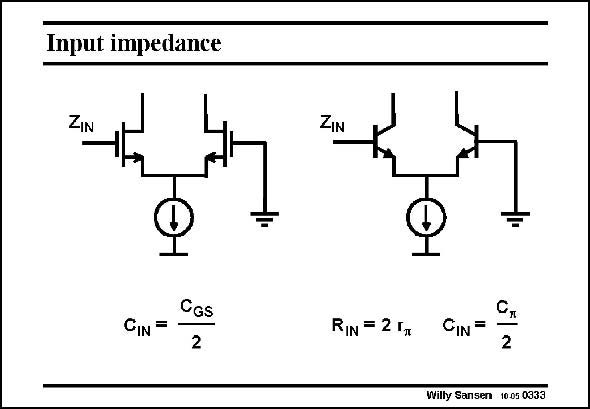

# SANSEN-0333 · Input impedance

章节：03 差分电压放大器与电流放大器  
PDF 页：104；书本页：106；幻灯片编号：0333  
状态：unreviewed



## 对应教材讲解

### PDF 104 · 书本 106

The input impedance of a differential pair is two times the input impedance of a single transistor. This means that the input resistance must be doubled, as in a bipolar transistor pair on the right. The input capacitance must be halved, however.

## 公式／性能结论候选摘录

以下为规则截取的原文，尚未逐项判读。

（未由规则找到；不代表原页没有此类内容。）

## 曲线结论候选摘录

以下为规则截取的原文，尚未逐项判读。

（未由规则找到；不代表原页没有此类内容。）

## 原文条件与近似候选摘录

以下为规则截取的原文，尚未逐项判读。

（未由规则找到；不代表原页没有此类内容。）

## 幻灯片 OCR（未校正）

```text
Input impedance
ZIN
CIN =
CGS
2
ZIN
RIN = 2 гm
CIN =
C,
2
Willy Sansen 10.05 0333
```

数学上下标、分数及正负号以原图为准。电路图已保留；未核对的连接不输出成可仿真 netlist。
