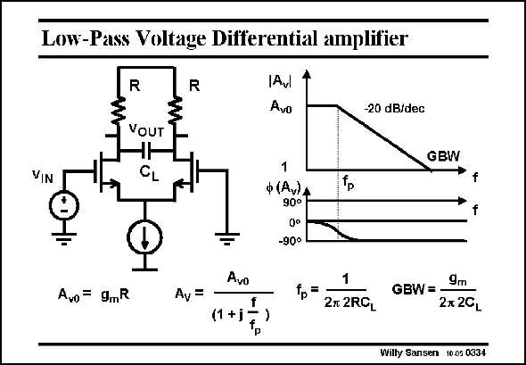

# SANSEN-0334 · Low-Pass Voltage Differential amplifier

章节：03 差分电压放大器与电流放大器  
PDF 页：104；书本页：106；幻灯片编号：0334  
状态：unreviewed



## 对应教材讲解

### PDF 104 · 书本 106

In order to conclude this section on differential voltage amplifiers, a few simple circuits are added playing with capacitances. Obviously the load capacitance C generates a L low-pass filter characteristic. The pole time constant is two times RC . L Since this is a first-order filter, the slope is 20 dB/ decade.

## 公式／性能结论候选摘录

以下为规则截取的原文，尚未逐项判读。

（未由规则找到；不代表原页没有此类内容。）

## 曲线结论候选摘录

以下为规则截取的原文，尚未逐项判读。

- PDF 104: Obviously the load capacitance C generates a L low-pass filter characteristic.
- PDF 104: L Since this is a first-order filter, the slope is 20 dB/ decade.

## 原文条件与近似候选摘录

以下为规则截取的原文，尚未逐项判读。

（未由规则找到；不代表原页没有此类内容。）

## 幻灯片 OCR（未校正）

```text
Low-Pass Voltage Differential amplifier
VIN
R
VOUT
CL
R
Avl
Avo
-20 dB/dec
GBW
ф (Av)A
90°
Qo
-90°
$
Avo= 9.R
Av =
Avo
(1 +j
f
1
2r 2RCL
9m
GBW =•
27 20L
Willy Sansen 10.05 0334
```

数学上下标、分数及正负号以原图为准。电路图已保留；未核对的连接不输出成可仿真 netlist。
