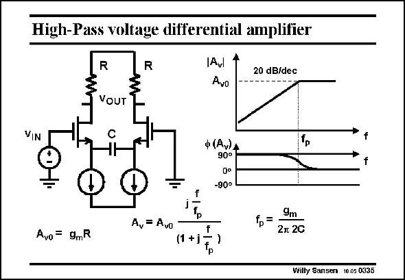

# SANSEN-0335 · High-Pass voltage differential amplifier

章节：03 差分电压放大器与电流放大器  
PDF 页：105；书本页：107；幻灯片编号：0335  
状态：unreviewed



## 对应教材讲解

### PDF 105 · 书本 107

Connecting that capacitance C between both sources, yields a high-pass characteristic. The pole time-constant is at g /2C because the m capacitance sees two resistances 1/g in series in order m to reach ground. Again the slope is 20 dB/ decade. The actual calculation of this gain characteristic is described in the next slide.

## 公式／性能结论候选摘录

以下为规则截取的原文，尚未逐项判读。

- PDF 105: The actual calculation of this gain characteristic is described in the next slide.

## 曲线结论候选摘录

以下为规则截取的原文，尚未逐项判读。

- PDF 105: Connecting that capacitance C between both sources, yields a high-pass characteristic.
- PDF 105: Again the slope is 20 dB/ decade.
- PDF 105: The actual calculation of this gain characteristic is described in the next slide.

## 原文条件与近似候选摘录

以下为规则截取的原文，尚未逐项判读。

（未由规则找到；不代表原页没有此类内容。）

## 幻灯片 OCR（未校正）

```text
High-Pass voltage differential amplifier
R
R
Avl
Avo
20 dB/dec
VOUT
Vi
IN
C
ф (Av)А
90°
-90°
A,= Avo
9m
2л 2C
Avo= 9mR
(1 +j
Willy Sansen 10.05 0335
```

数学上下标、分数及正负号以原图为准。电路图已保留；未核对的连接不输出成可仿真 netlist。
