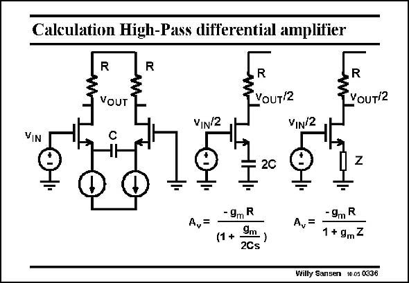

# SANSEN-0336 · Calculation High-Pass differential amplifier

章节：03 差分电压放大器与电流放大器  
PDF 页：105；书本页：107；幻灯片编号：0336  
状态：unreviewed



## 对应教材讲解

### PDF 105 · 书本 107

The calculation of the gain characteristics of a differential amplifier can always performed on the ‘‘differential half circuit’’. For this purpose, all bridge elements have to be multiplied or divided by two. For example capacitance C must be multiplied by 2. A resistor would have to be divided by 2! Also, both the input and output voltage are halved, by halving the circuit itself. The gain is now easily calculated. Impedance Z provides feedback by means of feedback factor 1+g Z. Substitution of Z m by 1/Cs or 1/Cjv then provides the final gain expression.

## 公式／性能结论候选摘录

以下为规则截取的原文，尚未逐项判读。

- PDF 105: The calculation of the gain characteristics of a differential amplifier can always performed on the ‘‘differential half circuit’’.
- PDF 105: The gain is now easily calculated.
- PDF 105: Substitution of Z m by 1/Cs or 1/Cjv then provides the final gain expression.

## 曲线结论候选摘录

以下为规则截取的原文，尚未逐项判读。

- PDF 105: The calculation of the gain characteristics of a differential amplifier can always performed on the ‘‘differential half circuit’’.

## 原文条件与近似候选摘录

以下为规则截取的原文，尚未逐项判读。

（未由规则找到；不代表原页没有此类内容。）

## 幻灯片 OCR（未校正）

```text
Calculation High-Pass differential amplifier
VOUT
VOUT/2
R
VOUT/2
Vi
IN
VIN/2
VIN/2
2C
Z
- 9mR
(1 +
9m )
2Cs
- 9m R
A,=
1 + 9mZ
Willy Sansen 10.05 0336
```

数学上下标、分数及正负号以原图为准。电路图已保留；未核对的连接不输出成可仿真 netlist。
