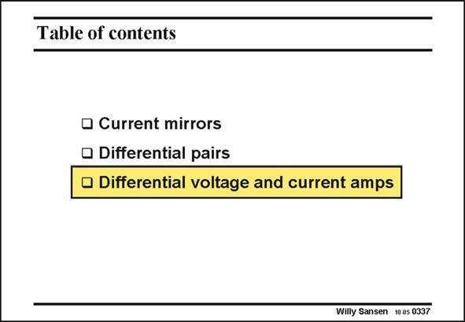

# SANSEN-0337 · Table of contents

章节：03 差分电压放大器与电流放大器  
PDF 页：106；书本页：108；幻灯片编号：0337  
状态：unreviewed



## 对应教材讲解

### PDF 106 · 书本 108

Now that we have a good understanding of current mirrors and voltage pairs, let us combine them in differential voltage and current amplifiers. All subsequent circuits are actually combinations of current mirrors and differential pairs, with as the primary requirement, to increase the gain but also to convert the differential output in a single-ended one. This is necessary to avoid differential pairs in a second stage of an amplifier. Most opamps will indeed use just a single-transistor amplifier as a second stage. The simplest amplifier usually provides the widest bandwidth. A single transistor is hard to beat!

## 公式／性能结论候选摘录

以下为规则截取的原文，尚未逐项判读。

- PDF 106: All subsequent circuits are actually combinations of current mirrors and differential pairs, with as the primary requirement, to increase the gain but also to convert the differential output in a single-ended one.
- PDF 106: The simplest amplifier usually provides the widest bandwidth.

## 曲线结论候选摘录

以下为规则截取的原文，尚未逐项判读。

（未由规则找到；不代表原页没有此类内容。）

## 原文条件与近似候选摘录

以下为规则截取的原文，尚未逐项判读。

（未由规则找到；不代表原页没有此类内容。）

## 幻灯片 OCR（未校正）

```text
Table of contents
• Current mirrors
• Differential pairs
• Differential voltage and current amps
Willy Sansen 10 0s 0337
```

数学上下标、分数及正负号以原图为准。电路图已保留；未核对的连接不输出成可仿真 netlist。
