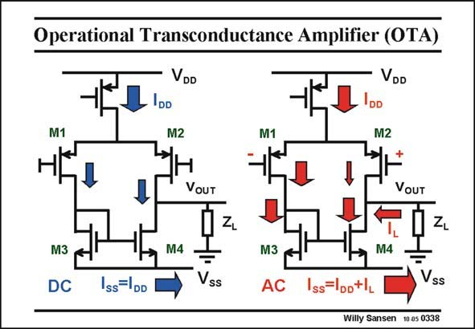

# SANSEN-0338 · Operational Transconductance Amplifier (OTA)

章节：03 差分电压放大器与电流放大器  
PDF 页：106；书本页：108；幻灯片编号：0338  
状态：unreviewed



## 对应教材讲解

### PDF 106 · 书本 108

The amplifier in this slide is called an OTA. It consists of one differential pair loaded by a simple current mirror. It has thus one single output indeed. On the left, the DC current flows are shown. The width of the arrow corresponds to the size of the current. The current source I DD is divided by two over both input devices, and is taken up by the negative supply. Obviously, both supply currents are the same, as no current can escape. Indeed, no current can escape at the output! On the right, the currents are shown when an input voltage is applied. This voltage is such that the current in M1 increases, causing a decrease by the same amount in the other transistor M2. The current source receives this larger current in M3 and forces the same current through M4. At the output there is a big difference between what is offered by M2 and what is required by M4. This difference is the output current. It flows through the load impedance Z , and causes L an output voltage. Again the supply currents and the current through load Z must add up correctly, to keep L Kirchoff happy!

## 公式／性能结论候选摘录

以下为规则截取的原文，尚未逐项判读。

- PDF 106: It has thus one single output indeed.
- PDF 106: This voltage is such that the current in M1 increases, causing a decrease by the same amount in the other transistor M2.

## 曲线结论候选摘录

以下为规则截取的原文，尚未逐项判读。

（未由规则找到；不代表原页没有此类内容。）

## 原文条件与近似候选摘录

以下为规则截取的原文，尚未逐项判读。

（未由规则找到；不代表原页没有此类内容。）

## 幻灯片 OCR（未校正）

```text
Operational Transconductance Amplifier (OTA)
VDD
IDD
VDD
IDD
M2
M1
M2
VoUT
VOUT
M3
DC
M4
Iss DD
Vss
M3
M4
AC Iss=loD+lL l
Vss
Willy Sansen 10 as 0338
```

数学上下标、分数及正负号以原图为准。电路图已保留；未核对的连接不输出成可仿真 netlist。
