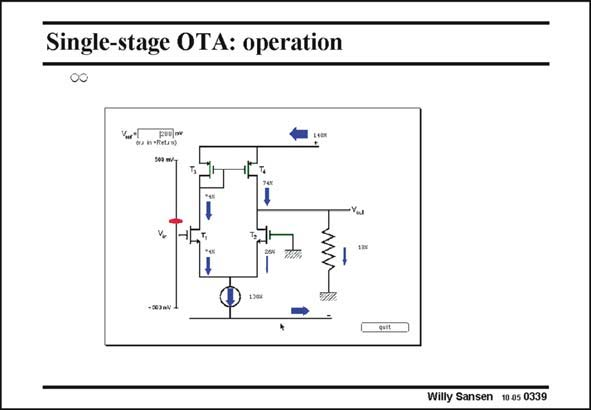

# SANSEN-0339 · Single-stage OTA: operation

章节：03 差分电压放大器与电流放大器  
PDF 页：107；书本页：109；幻灯片编号：0339  
状态：unreviewed



## 对应教材讲解

### PDF 107 · 书本 109

The same current flows are given for this inverted OTA. An input voltage of several mV’s will cause a difference in current in the input devices. The current in T1 is 74% of the total current in the current source, leaving 26% for the other transistor T2. This difference in current has previously been called circular current. It is thus 24% of the current of the DC current source or 48% of the DC transistor current! This current of 74% flows through three devices, whereas the fourth transistor T2 only carries 26%. This is a very asymmetrical gain stage indeed. This is a result of the single-ended nature of this circuit. The current through the load is then the difference between 74% of T4 and 26% of T2, which is 48%. The load resistance converts this current into an output voltage. Normally there is no load resistor. It actually consists of the two output resistances r of the DS transistors T2 and T4 in parallel.

## 公式／性能结论候选摘录

以下为规则截取的原文，尚未逐项判读。

- PDF 107: It is thus 24% of the current of the DC current source or 48% of the DC transistor current!
- PDF 107: This is a very asymmetrical gain stage indeed.

## 曲线结论候选摘录

以下为规则截取的原文，尚未逐项判读。

（未由规则找到；不代表原页没有此类内容。）

## 原文条件与近似候选摘录

以下为规则截取的原文，尚未逐项判读。

（未由规则找到；不代表原页没有此类内容。）

## 幻灯片 OCR（未校正）

```text
Single-stage OTA: operation
Willy Sansen 10 0s 0339
```

数学上下标、分数及正负号以原图为准。电路图已保留；未核对的连接不输出成可仿真 netlist。
