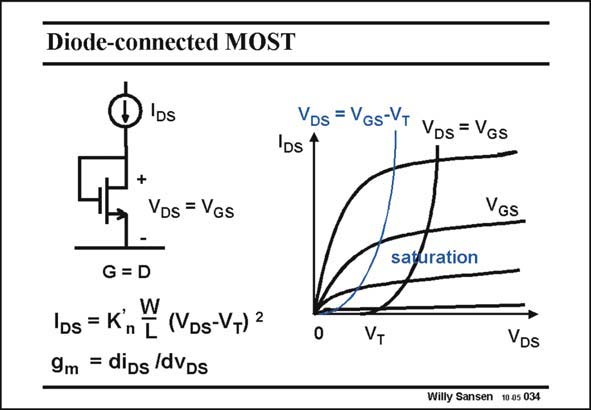

# SANSEN-034 · Diode-connected MOST

章节：03 差分电压放大器与电流放大器  
PDF 页：88；书本页：90；幻灯片编号：034  
状态：unreviewed



## 对应教材讲解

### PDF 88 · 书本 90

The input of a current mirror consists of a diodeconnected transistor. Connecting Collector to Base in a bipolar transistor, gives us a real base-emitter diode. In a MOST however, there is no Gate-Source diode. However, connecting the Drain to the Gate provides us with something similar. Indeed, the current voltage characteristic is obtained by shifting the curve, separating the linear and the saturation region, which is at V =V −V , to the right by V . DS GS T T As a result, we can use the current-voltage characteristic of a MOST in saturation. The resulting curve is very nonlinear, however. It resembles somewhat, a diode characteristic. We will use this simple circuit to convert current to voltage.

## 公式／性能结论候选摘录

以下为规则截取的原文，尚未逐项判读。

- PDF 88: DS GS T T As a result, we can use the current-voltage characteristic of a MOST in saturation.

## 曲线结论候选摘录

以下为规则截取的原文，尚未逐项判读。

- PDF 88: Indeed, the current voltage characteristic is obtained by shifting the curve, separating the linear and the saturation region, which is at V =V −V , to the right by V .
- PDF 88: DS GS T T As a result, we can use the current-voltage characteristic of a MOST in saturation.
- PDF 88: The resulting curve is very nonlinear, however.
- PDF 88: It resembles somewhat, a diode characteristic.

## 原文条件与近似候选摘录

以下为规则截取的原文，尚未逐项判读。

- PDF 88: Indeed, the current voltage characteristic is obtained by shifting the curve, separating the linear and the saturation region, which is at V =V −V , to the right by V .
- PDF 88: DS GS T T As a result, we can use the current-voltage characteristic of a MOST in saturation.

## 幻灯片 OCR（未校正）

```text
Diode-connected MOST
)IDs
+
-
G = D
VDs = VGs
IDs = Kn [ (VDs-VT) 2
9m = diDs /dVDs
Vos= Vos-VT VDs= Vos
IDs 1
VGS
saturation
VT
VDs
Willy Sansen 10 a5 034
```

数学上下标、分数及正负号以原图为准。电路图已保留；未核对的连接不输出成可仿真 netlist。
