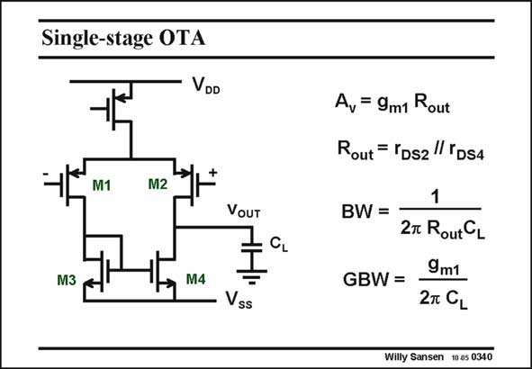

# SANSEN-0340 · Single-stage OTA

章节：03 差分电压放大器与电流放大器  
PDF 页：107；书本页：109；幻灯片编号：0340  
状态：unreviewed



## 对应教材讲解

### PDF 107 · 书本 109

The gain is now easily calculated. If we denote the output resistance by R , which is out again the parallel combination of the two output resistances r of the transistors DS T2 and T4, then the gain is simply g R . m1 out The bandwidth is cause by the output capacitance and the same resistance R . out As a result, the GBW is again the same as for a single-transistor amplifier. Indeed, this is a single-stage amplifier because only one single high-impedance point can be distinguished, i.e. at the output. All other nodes are on the 1/g impedance level. m The gain is not very high however. We could use cascodes to increase the gain. Gain boosting and current cancellation have also been discussed. We will now introduce a fourth technique to enhance gain, bootstrapping.

## 公式／性能结论候选摘录

以下为规则截取的原文，尚未逐项判读。

- PDF 107: The gain is now easily calculated.
- PDF 107: If we denote the output resistance by R , which is out again the parallel combination of the two output resistances r of the transistors DS T2 and T4, then the gain is simply g R . m1 out The bandwidth is cause by the output capacitance and the same resistance R . out As a result, the GBW is again the same as for a single-transistor amplifier.
- PDF 107: All other nodes are on the 1/g impedance level. m The gain is not very high however.
- PDF 107: We could use cascodes to increase the gain.
- PDF 107: Gain boosting and current cancellation have also been discussed.
- PDF 107: We will now introduce a fourth technique to enhance gain, bootstrapping.

## 曲线结论候选摘录

以下为规则截取的原文，尚未逐项判读。

（未由规则找到；不代表原页没有此类内容。）

## 原文条件与近似候选摘录

以下为规则截取的原文，尚未逐项判读。

（未由规则找到；不代表原页没有此类内容。）

## 幻灯片 OCR（未校正）

```text
Single-stage OTA
VDD
M1
M2
VOUT
M3
M4
Vss
A, = 9m1 Rout
Rout = YDs2TDS4
BW =
1
2m RoutCL
GBW =
9m1
27 CL
Willy Sansen 1005 0340
```

数学上下标、分数及正负号以原图为准。电路图已保留；未核对的连接不输出成可仿真 netlist。
